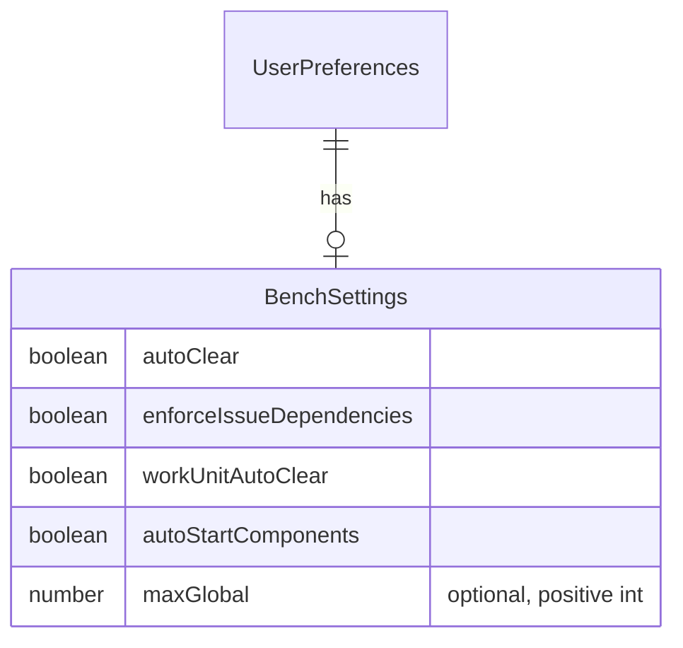
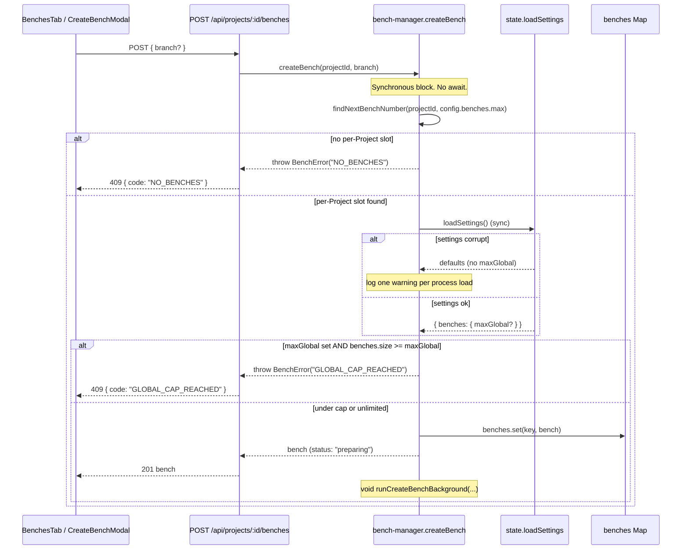
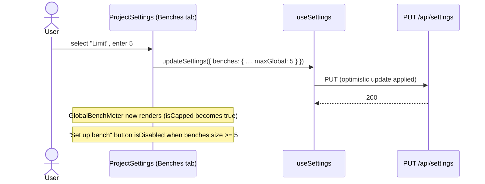
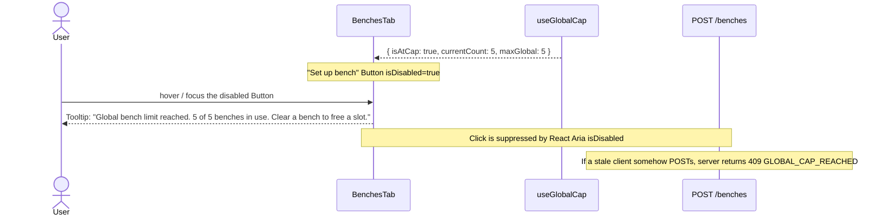
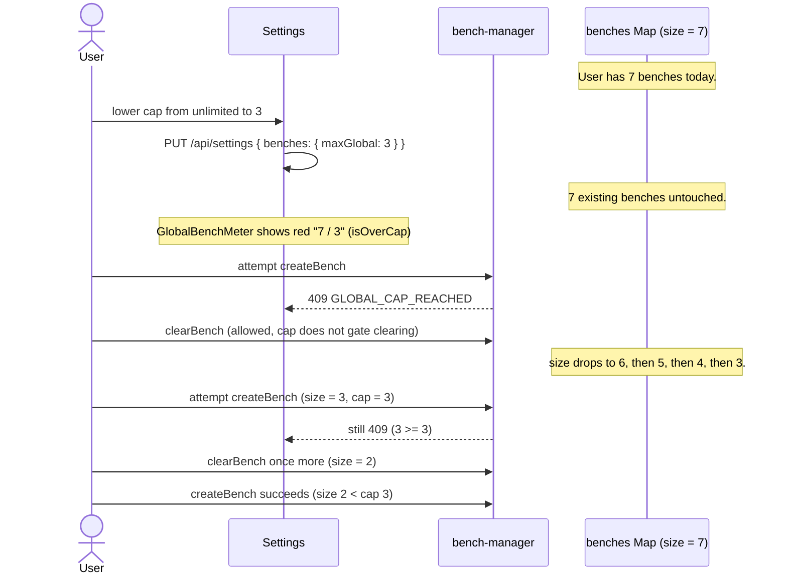

# Architecture: Global Bench Limit

> Slug: `global-bench-limit` · Designed: 2026-05-22

## Overview

We are adding one application-wide ceiling, `UserPreferences.benches.maxGlobal`, on top of the existing per-Project `benches.max` mechanism. The cap is opt-in (absent or `null` means unlimited), persisted in `~/.roubo/settings.json`, validated by the existing `PUT /api/settings` route, and enforced inside the existing synchronous reservation block in `bench-manager.createBench` (`server/services/bench-manager.ts:404-459`). The cap surfaces in the renamed "Benches" Settings tab, on a new global meter in the Benches tab of `BenchDashboard`, and as a disabled-state "Set up bench" button with an accessible tooltip when the cap is hit. No new persistence file, no new lock, no new route, and no new top-level client query are introduced. Everything attaches to existing primitives: `loadSettings`/`saveSettings`, the `BenchError`-to-HTTP mapper, `useSettings`, `useAllBenches`, and the React Aria `Button` + `TooltipTrigger` pattern already in `BenchCard` and `SectionProjectInfo`.

## Context and constraints

Roubo is a single-user macOS + Linux desktop tool. The user lives in one Node process; the server's in-memory `benches: Map<string, Bench>` already holds every Bench across every Project, and Node's single-threaded event loop already serializes any synchronous block. Per-Project caps (`config.benches.max`, 1–99) are enforced today via `findNextBenchNumber` followed by `benches.set(...)` with an explicit "no `await` between these two lines" comment. The global cap collapses to the same primitive: read `benches.size`, compare to `maxGlobal`, throw `BenchError("GLOBAL_CAP_REACHED")` before `benches.set`. This is why the feature does not need a file lock around `state.json`: the correctness boundary is the Map, not the file.

Settings persistence is already a solved problem on the same file (`~/.roubo/settings.json`), via `loadSettings`/`saveSettings` in `server/services/state.ts:183-217`, surfaced through `GET/PUT /api/settings` (`server/routes/settings.ts`). `loadSettings` already default-merges and returns defaults on `JSON.parse` failure, so fail-open behaviour on corruption is mechanical: an unreadable file yields `benches: DEFAULT_BENCH_SETTINGS` which has no `maxGlobal` field, which means unlimited.

Backward compatibility is structurally guaranteed: every layer (shared type, route validator, default-merge, client read) treats `maxGlobal` as optional. Existing installs that have never set the cap behave identically to today.

Concurrency at the cap boundary is identical to the existing per-Project cap. The synchronous reservation block already prevents two `createBench` calls from observing a stale count. No new locking primitive is required. The pre-existing `state.json` write-race (last-rename-wins under concurrent `addBench` calls) is documented in feasibility as out-of-scope; the global cap does not depend on `state.json` for correctness.

## Existing architecture summary

Server (read-only context for the implementer):

- `server/services/bench-manager.ts:404-459` — `createBench`. The reservation block (`findNextBenchNumber` → `benches.set`) is the integration point. The inline comment at lines 414-416 is load-bearing.
- `server/services/bench-manager.ts:400-401` — `isBenchStillActive` helper, illustrates the Map-as-truth pattern.
- `server/services/bench-manager.ts:1804-1812` — `BenchError` class with `code` field; mapped to HTTP by routes.
- `server/services/issue-assignment.ts:177` — second call site of `benchManager.createBench`; propagates `BenchError` to the route layer unchanged.
- `server/services/state.ts:183-217` — `loadSettings` and `saveSettings`. `loadSettings` already has the try/catch fail-open behaviour we need.
- `server/services/auto-clear.ts` — only calls `teardownBench`; never calls `createBench`. Confirms the cap need not gate auto-clear.
- `server/routes/settings.ts:31-123` — `PUT /api/settings`. Validates each sub-shape (theme, blueprints, benches, claudeCode, github). Mirrors the `github.issueTypesCacheTtlSeconds` integer pattern at lines 90-103.
- `server/routes/benches.ts:65-71` and `87-97` — `BenchError`-to-HTTP mapper for both the combined `create-and-assign` flow and the plain `POST /benches` flow.

Shared:

- `shared/types.ts:897-909` — `BenchSettings` interface and `DEFAULT_BENCH_SETTINGS` constant.
- `shared/types.ts:929-941` — `UserPreferences` and `SettingsResponse`.

Client:

- `client/src/hooks/useSettings.ts:42-73` — `useSettings()`, returns `{ settings, isLoading, updateSettings }` with optimistic mutation.
- `client/src/hooks/useBenches.ts:8-14` — `useAllBenches()`, cross-Project Bench list via React Query (`["benches"]` key, 5s/1s refetch).
- `client/src/components/ProjectSettings.tsx:133-194` — `BenchesTab`. Lines 145-147 contain the "Bench Defaults" section header. Lines 712-715 contain `TAB_LABELS`.
- `client/src/components/ProjectSettings.tsx:284-307` and `:652-707` — existing `RadioGroup` usage, the reuse target for the Unlimited / Limit choice.
- `client/src/components/ProjectTile.tsx:13-72` — per-Project meter pattern with `bg-green-500/70` fill and `aria`-friendly text "X / Y benches".
- `client/src/components/BenchDashboard.tsx:98` — `openCreateBench = () => setShowCreate(true)`, passed down via `ProjectOutletContext`.
- `client/src/components/BenchesTab.tsx:58-64` — the "Set up bench" Button that triggers `openCreateBench`. This is the disabled-state target.
- `client/src/components/CreateBenchModal.tsx:120-127` — the modal's confirm Button. Defense-in-depth target.

## Proposed components

### `BenchSettings.maxGlobal` field

- **Path**: `shared/types.ts` (extends `BenchSettings` at lines 897-902).
- **Responsibility**: Persist the user-chosen global cap as an optional positive integer on the existing `BenchSettings` sub-shape.
- **Reuse vs new**: extension of `BenchSettings`. Chosen over `UserPreferences.maxBenchesGlobal` (seed-style placement) because the field is Bench-domain and the existing `benches: BenchSettings` block is already the home for Bench-related preferences. `DEFAULT_BENCH_SETTINGS` does not declare a default value: the absence of the field is the unlimited signal.
- **Public interface**:
  ```ts
  export interface BenchSettings {
    autoClear: boolean;
    enforceIssueDependencies: boolean;
    workUnitAutoClear: boolean;
    autoStartComponents: boolean;
    maxGlobal?: number; // positive integer; absent means unlimited
  }
  ```
- **Dependencies**: consumed by `loadSettings`, `PUT /api/settings`, `createBench`, `useSettings`, the Settings UI, and the dashboard meter.

### `createBench` global-cap check

- **Path**: `server/services/bench-manager.ts:404-459` (inside the existing reservation block, after `findNextBenchNumber` succeeds and before `benches.set`).
- **Responsibility**: Reject creation with `BenchError("GLOBAL_CAP_REACHED", ...)` when `benches.size >= maxGlobal`.
- **Reuse vs new**: extension of the existing reservation block. No new function. No new lock. The check is a 3-line synchronous insertion.
- **Public interface**: no public surface change. `createBench(projectId, branch?)` signature is unchanged. The new failure path throws `BenchError` with `code: "GLOBAL_CAP_REACHED"` and message `Global bench limit reached: {currentCount} of {maxGlobal} benches in use.`
- **Dependencies**: `loadSettings()` from `state.ts` (synchronous, wrapped in try/catch; on throw, treats cap as unlimited and logs one warning per process load via a module-level `corruptedSettingsWarned` flag).

### `PUT /api/settings` validator extension

- **Path**: `server/routes/settings.ts` (extend the `body.benches` validation block at lines 56-70).
- **Responsibility**: Reject malformed `maxGlobal` values with HTTP 400 before they reach `saveSettings`.
- **Reuse vs new**: extension of the existing block. The validation rule mirrors the `github.issueTypesCacheTtlSeconds` pattern at lines 90-103: `Number.isInteger(v) && v >= 1`. `0`, negatives, non-integers, `NaN`, `Infinity` are rejected. `null` or `undefined` are accepted and mean unlimited; on `null` the field is stripped before persistence (consistent with how `blueprints.defaultBlueprintId` is conditionally included at lines 107-110).
- **Public interface**: HTTP contract unchanged. New 400 error message: `Invalid bench settings: maxGlobal must be a positive integer (>= 1) or null.`
- **Dependencies**: `loadSettings`, `saveSettings`.

### `BenchesTab` "Global bench limit" control

- **Path**: `client/src/components/ProjectSettings.tsx` (new section inside `BenchesTab` at lines 133-194, above the existing "Bench Defaults" section). The in-tab section header at line 146 stays "Bench Defaults"; only the outer tab label changes.
- **Responsibility**: Render a RadioGroup with two options (`Unlimited`, `Limit`). When `Limit` is selected, a numeric `TextField` appears beneath. Save dispatches `updateSettings({ ...settings, benches: { ...benchSettings, maxGlobal: value | undefined } })`.
- **Reuse vs new**: extension of `BenchesTab`. The RadioGroup choice resolves prototype open question (1): `ProjectSettings.tsx` already uses React Aria `RadioGroup` at lines 284-307 and 652-707; reusing it keeps visual and a11y consistency with the rest of the tab. We do not use `Switch` (the Switch precedent at line 88 is for boolean toggles, and the Limit / Unlimited choice has an associated numeric input that pairs better with a RadioGroup affordance).
- **Public interface**: no new props. Reads `settings.benches.maxGlobal` from `useSettings()`. Writes via `updateSettings`. Validation message renders red text below the input on `<= 0`, non-integer, or empty-when-Limit-selected.
- **Dependencies**: `useSettings`, `BenchSettings` type.

### `TAB_LABELS` rename

- **Path**: `client/src/components/ProjectSettings.tsx:712-715`.
- **Responsibility**: Display the tab as "Benches" instead of "Bench Defaults".
- **Reuse vs new**: one-line edit to the existing map.
- **Public interface**: none.
- **Dependencies**: none.

### `useGlobalCap` derived hook

- **Path**: `client/src/hooks/useGlobalCap.ts` (new file).
- **Responsibility**: Centralize the derivation `{ maxGlobal, currentCount, isAtCap, isOverCap, isCapped }` so `BenchesTab`, `BenchDashboard`, `CreateBenchModal`, and the new meter all read from one source.
- **Reuse vs new**: new hook, but it is purely a memoized composition of `useSettings()` and `useAllBenches()`. No new fetch, no new query key. Resolves prototype open question (2): sum `useAllBenches()` client-side rather than adding a `totalCount` field to `GET /api/benches`. Reason: `useAllBenches` is already cached with 5s/1s refetch; introducing a derived server field would either duplicate that data or force a redesign of the existing `Bench[]` shape. The "refetch loop" concern from the prototype notes does not apply: there is only one `["benches"]` query key, not per-Project caches that could diverge.
- **Public interface**:
  ```ts
  export interface GlobalCapState {
    maxGlobal: number | null; // null = unlimited
    currentCount: number;
    isCapped: boolean; // maxGlobal !== null
    isAtCap: boolean; // currentCount >= maxGlobal
    isOverCap: boolean; // currentCount > maxGlobal (after user lowers cap)
  }
  export function useGlobalCap(): GlobalCapState;
  ```
- **Dependencies**: `useSettings`, `useAllBenches`.

### `GlobalBenchMeter` component

- **Path**: `client/src/components/GlobalBenchMeter.tsx` (new file).
- **Responsibility**: Render "Global benches · N / M" with the same visual treatment as `ProjectTile`'s meter (1px bar, amber-throughout / red-at-cap fill, `font-mono` percent). Returns `null` when `!isCapped`.
- **Reuse vs new**: new component, but the markup is a near-copy of `ProjectTile.tsx:60-72`. Placement resolves prototype open question (3): the meter renders in the header strip of `BenchesTab` (the existing per-Project benches view, `client/src/components/BenchesTab.tsx:51-65`), next to the "Set up bench" button. Reason: there is no app-wide dashboard route today; `BenchDashboard` is the de-facto landing surface and `BenchesTab` is its primary tab. Duplicating on every Project view is acceptable because the data is one query and the component is tiny; we explicitly do not lift state up or create a new "All benches" page (out of scope per PRD).
- **Public interface**: no props; reads `useGlobalCap()`. `aria-label` of the form `Global benches: N of M`.
- **Dependencies**: `useGlobalCap`.
- **Colour ramp (resolves open question 5)**: neutral (`stone-400`) below 80%, amber (`amber-500`) at >= 80%, red (`red-500`) at >= 100%. The PRD calls for a meter "mirroring per-Project"; the per-Project meter is single-colour green. We adopt the staged ramp because the global cap is a harder ceiling (creation is blocked, not just per-Project routing) and the user benefits from a leading visual signal. The over-cap state (after lowering) uses the same red.

### `BenchesTab` and `CreateBenchModal` disabled-state wiring

- **Path**: `client/src/components/BenchesTab.tsx:58-64` (the primary "Set up bench" Button) and `client/src/components/CreateBenchModal.tsx:120-127` (defense in depth).
- **Responsibility**: When `isAtCap || isOverCap` from `useGlobalCap()`, set `isDisabled` on both Buttons and wrap each in a React Aria `TooltipTrigger` with the explanatory message.
- **Reuse vs new**: extension. React Aria `TooltipTrigger` already wraps interactive elements in `BenchCard` and `SectionProjectInfo`; reuse that pattern.
- **Public interface**: no prop changes; `BenchesTab` reads `useGlobalCap()` directly.
- **Tooltip copy (resolves open question 4)**: `"Global bench limit reached. {currentCount} of {maxGlobal} benches in use. Clear a bench to free a slot."` We include the CTA because the user has no other affordance to discover the resolution (there is no link to Settings, no inline action). The CTA is text only; no link, to keep the tooltip semantically simple.
- **Dependencies**: `useGlobalCap`.

### `BenchError` 409 mapping for `GLOBAL_CAP_REACHED`

- **Path**: `server/routes/benches.ts:65-71` (combined flow) and `:91-93` (plain flow).
- **Responsibility**: Map `BenchError.code === "GLOBAL_CAP_REACHED"` to HTTP 409.
- **Reuse vs new**: extension of the existing ternary. Add `|| err.code === "GLOBAL_CAP_REACHED"` to the 409 branch.
- **Public interface**: HTTP 409 with body `{ error: string, code: "GLOBAL_CAP_REACHED" }`.
- **Dependencies**: none.

## Data model

The only change is one optional field on the existing `BenchSettings` sub-shape inside `UserPreferences`. No new table, no migration, no new file.

```ts
// Before
export interface BenchSettings {
  autoClear: boolean;
  enforceIssueDependencies: boolean;
  workUnitAutoClear: boolean;
  autoStartComponents: boolean;
}

// After
export interface BenchSettings {
  autoClear: boolean;
  enforceIssueDependencies: boolean;
  workUnitAutoClear: boolean;
  autoStartComponents: boolean;
  maxGlobal?: number; // positive integer (>= 1); absent means unlimited
}
```

`DEFAULT_BENCH_SETTINGS` is unchanged (no `maxGlobal` key). This means `loadSettings`'s spread `{ ...DEFAULT_BENCH_SETTINGS, ...raw.benches }` at `state.ts:199` preserves the field when present and omits it when absent, without further code change.

Validation rules (enforced at `PUT /api/settings`):

| Input                    | Accepted? | Result                                |
| ------------------------ | --------- | ------------------------------------- |
| field absent             | yes       | unlimited                             |
| `null`                   | yes       | field stripped before save; unlimited |
| positive integer >= 1    | yes       | persisted                             |
| `0`                      | no        | HTTP 400                              |
| negative integer         | no        | HTTP 400                              |
| non-integer (e.g. `1.5`) | no        | HTTP 400                              |
| `NaN`                    | no        | HTTP 400                              |
| `Infinity`               | no        | HTTP 400                              |
| non-number type          | no        | HTTP 400                              |

No upper bound is enforced. The per-Project `benches.max` cap of 99 is a `roubo.yaml` schema concern; the global cap is a user setting and a user who deliberately enters a large number is not protected against themselves (and may legitimately want a large headroom).



## Sequence flows

### Create-bench flow with cap check



### Settings-update flow

```mermaid
sequenceDiagram
    participant UI as BenchesTab control
    participant Hook as useSettings.updateSettings
    participant Route as PUT /api/settings
    participant State as state.saveSettings
    participant Cache as React Query ["settings"]

    UI->>Hook: updateSettings({ ...prev, benches: { ...prev.benches, maxGlobal } })
    Hook->>Cache: optimistic set (onMutate)
    Hook->>Route: PUT /api/settings { ...body }
    Route->>Route: validate body.benches.maxGlobal
    alt invalid (0, negative, non-int, NaN, Infinity, non-number)
        Route-->>Hook: 400 { error }
        Hook->>Cache: rollback to previous (onError)
        Hook-->>UI: validation error
    else valid or absent/null
        Route->>Route: strip maxGlobal if null
        Route->>State: saveSettings(updated)
        State-->>Route: ok
        Route-->>Hook: 200 updated
        Hook->>Cache: settled (settings cache is now authoritative)
        Note over UI,Cache: useAllBenches is untouched; useGlobalCap recomputes on next render
    end
```

### User path: setting the cap (US-001)



### User path: attempting to create at the cap (US-002)



### User path: lowering the cap below current count (US-004)



## Integration points

- **`shared/types.ts:897-902`** — extend `BenchSettings` with optional `maxGlobal?: number`. No change to `DEFAULT_BENCH_SETTINGS`.
- **`server/services/state.ts:183-217`** — no code change required. The existing `{ ...DEFAULT_BENCH_SETTINGS, ...raw.benches }` spread preserves `maxGlobal` when present and the existing try/catch already implements fail-open. Verify with a test against a corrupt fixture.
- **`server/services/bench-manager.ts:404-459`** — insert the cap check inside the synchronous reservation block, after `findNextBenchNumber` succeeds and before `benches.set`. Read `loadSettings()` once per call. Wrap in try/catch with a module-level `corruptedSettingsWarned` boolean to satisfy NFR-004's "one warning per process load" requirement.
- **`server/routes/settings.ts:56-70`** — extend the `body.benches` validator with `maxGlobal` rules. Strip `maxGlobal: null` in the `updated` object so persistence never stores explicit nulls.
- **`server/routes/benches.ts:65-71` and `:91-93`** — add `"GLOBAL_CAP_REACHED"` to the 409 branch of both `BenchError` ternaries.
- **`client/src/components/ProjectSettings.tsx:712-715`** — rename `benches: "Bench Defaults"` → `benches: "Benches"` in `TAB_LABELS`. The section header at line 146 stays "Bench Defaults" (it labels a sub-section; out of scope to rename).
- **`client/src/components/ProjectSettings.tsx:133-194`** — add a new section above the existing one inside `BenchesTab`: RadioGroup (Unlimited / Limit) plus a numeric `TextField` for the limit value. Validation error renders inline; save dispatches through `updateSettings`.
- **`client/src/hooks/useGlobalCap.ts`** — new file. Composes `useSettings()` and `useAllBenches()` into the derived `GlobalCapState`.
- **`client/src/components/GlobalBenchMeter.tsx`** — new file. Renders the meter when `isCapped`. Mirrors `ProjectTile.tsx:60-72` markup with the staged colour ramp.
- **`client/src/components/BenchesTab.tsx:51-65`** — render `<GlobalBenchMeter />` in the header strip; wrap the "Set up bench" Button in `TooltipTrigger`; pass `isDisabled` from `useGlobalCap`.
- **`client/src/components/CreateBenchModal.tsx:120-127`** — read `useGlobalCap`; set `isDisabled` on the confirm Button when `isAtCap || isOverCap`; surface the 409 message in the existing `setError(...)` flow as defense in depth.
- **`server/services/issue-assignment.ts:177`** — no code change. `BenchError` propagates unchanged through this wrapper to the route mapper at `benches.ts:65-71`.

## Observability

- **Logs**:
  - `console.warn` once per process load when `loadSettings()` throws inside `createBench`'s cap-check path. Message: `[bench-manager] settings.json unreadable; treating global bench limit as unlimited.` Guarded by a module-level boolean to avoid log spam.
  - No log on every cap-block 409. The route already returns a structured error; logging would amount to telemetry, which is explicitly out of scope per PRD.
  - No log on settings save success. Existing settings-save path is silent; we keep that.
- **Metrics**: none. Telemetry is out of scope.
- **Traces**: none added. The cap check is O(1) and adds no measurable span.

## Security considerations

- No new authentication surface. The cap reuses the existing unauthenticated `/api/settings` route, consistent with Roubo's single-user desktop posture (NFR-003).
- Input validation is at the route layer per FR-002. `Number.isInteger(v) && v >= 1` blocks every malformed value enumerated in the data model table above. Hostile values cannot reach `bench-manager` or `state.json`.
- No data classification change. `~/.roubo/settings.json` is local-only, owned by the user's process, and is not network-replicated.
- No new attack surface. The new field is read by the same process that writes it, and the cap check itself is read-only against the in-memory Map.

## Risks and alternatives

- **Error-state Benches still count toward the cap.** A Bench that fails worktree provisioning sits in the Map with `status: "error"` and no on-disk workspace. The user sees "1 / 5" with nothing visible. Mitigation: the cap intentionally counts every Map entry; surfacing error-state Benches in the dashboard list (already the case via `useAllBenches`) gives the user a Clear affordance to free the slot. We do not filter `status: "error"` out of the count because that would create a divergence between client-side and server-side counting.
- **`loadSettings()` called on the hot path.** Every `createBench` call now does a synchronous `JSON.parse` of `settings.json`. Mitigation: per NFR-001 this is acceptable (the create path is user-initiated and infrequent), and `loadSettings` is already a small synchronous read. If profiling later shows it as a hotspot, a module-level cache invalidated on `saveSettings` is a one-screen change; not added now to avoid premature optimization.
- **Rejected alternative: file lock around `state.json`.** Considered for "strict first-write-wins" but rejected because the correctness boundary is the in-memory Map, not the file. Adding a lock would not change cap behaviour and would touch every `addBench` / `updateBench` / `removeBench` call site. The pre-existing state.json write-race is a paper-cut for a separate work unit, per feasibility.
- **Rejected alternative: `UserPreferences.maxBenchesGlobal` (flat placement).** Matches the seed prompt's phrasing but breaks the domain grouping. `BenchSettings.maxGlobal` keeps Bench-related preferences in one block and lines up with the renamed "Benches" tab.
- **Rejected alternative: derived `totalCount` field on `GET /api/benches`.** Considered to avoid client-side summing. Rejected because there is only one `["benches"]` query in the cache (no per-Project query divergence to worry about), and adding a server field would either change the response shape or duplicate data.
- **Rejected alternative: a global dashboard route hosting the meter.** Considered but no such route exists today. Building one is out of scope; `BenchesTab` is the natural home.

---

```
---
proposed_components:
  - id: bench-settings-max-global-field
    name: BenchSettings.maxGlobal field
    path: shared/types.ts
    type: shared-type
  - id: create-bench-cap-check
    name: createBench global-cap check
    path: server/services/bench-manager.ts
    type: server-service
  - id: settings-route-validator
    name: PUT /api/settings maxGlobal validator
    path: server/routes/settings.ts
    type: server-route
  - id: benches-route-409-mapper
    name: GLOBAL_CAP_REACHED to HTTP 409 mapping
    path: server/routes/benches.ts
    type: server-route
  - id: benches-tab-global-limit-control
    name: BenchesTab Global bench limit control
    path: client/src/components/ProjectSettings.tsx
    type: client-component
  - id: tab-labels-rename
    name: Benches tab label rename
    path: client/src/components/ProjectSettings.tsx
    type: client-component
  - id: use-global-cap-hook
    name: useGlobalCap derived hook
    path: client/src/hooks/useGlobalCap.ts
    type: client-hook
  - id: global-bench-meter
    name: GlobalBenchMeter component
    path: client/src/components/GlobalBenchMeter.tsx
    type: client-component
  - id: benches-tab-disabled-button
    name: BenchesTab Set up bench disabled state and tooltip
    path: client/src/components/BenchesTab.tsx
    type: client-component
  - id: create-bench-modal-disabled-confirm
    name: CreateBenchModal confirm disabled state
    path: client/src/components/CreateBenchModal.tsx
    type: client-component
integration_points:
  - id: ip-shared-types
    path: shared/types.ts
    change: Add optional maxGlobal field to BenchSettings interface.
  - id: ip-state-load-settings
    path: server/services/state.ts
    change: No code change; verify fail-open behaviour via test against a corrupt settings.json fixture.
  - id: ip-bench-manager-create
    path: server/services/bench-manager.ts
    change: Insert cap check between findNextBenchNumber and benches.set inside the synchronous reservation block; log one warning per process load on settings corruption.
  - id: ip-settings-route
    path: server/routes/settings.ts
    change: Validate body.benches.maxGlobal as positive integer or null; strip null before persistence.
  - id: ip-benches-route
    path: server/routes/benches.ts
    change: Map BenchError code GLOBAL_CAP_REACHED to HTTP 409 in both create paths (lines 65-71 and 91-93).
  - id: ip-project-settings-tab-labels
    path: client/src/components/ProjectSettings.tsx
    change: Rename TAB_LABELS.benches from "Bench Defaults" to "Benches".
  - id: ip-project-settings-benches-tab
    path: client/src/components/ProjectSettings.tsx
    change: Add Global bench limit RadioGroup and numeric TextField section to BenchesTab.
  - id: ip-use-global-cap
    path: client/src/hooks/useGlobalCap.ts
    change: New hook composing useSettings and useAllBenches into derived GlobalCapState.
  - id: ip-global-bench-meter
    path: client/src/components/GlobalBenchMeter.tsx
    change: New component rendering the global meter when isCapped, mirroring ProjectTile markup.
  - id: ip-benches-tab
    path: client/src/components/BenchesTab.tsx
    change: Render GlobalBenchMeter in header; wrap Set up bench Button in TooltipTrigger with isDisabled from useGlobalCap.
  - id: ip-create-bench-modal
    path: client/src/components/CreateBenchModal.tsx
    change: Disable confirm Button when at or over cap; surface server 409 message via existing setError flow.
  - id: ip-issue-assignment
    path: server/services/issue-assignment.ts
    change: No code change; BenchError propagates unchanged from benchManager.createBench at line 177.
risks_and_alternatives:
  - id: R-001
    category: ux
    severity: low
    risk: Error-state Benches with no on-disk workspace still count toward the cap.
    mitigation: useAllBenches already surfaces error-state Benches in the dashboard so the user can Clear them to free the slot.
    alternative_considered: Filter status:error out of the count; rejected because it would diverge client and server counting.
  - id: R-002
    category: perf
    severity: low
    risk: loadSettings called on every createBench reads and parses settings.json synchronously.
    mitigation: NFR-001 accepts this; the create path is user-initiated and infrequent.
    alternative_considered: Module-level cache invalidated by saveSettings; deferred until profiling justifies it.
  - id: R-003
    category: correctness
    severity: medium
    risk: Pre-existing state.json write race could clobber persisted Bench metadata under concurrent addBench calls.
    mitigation: Out of scope for this feature; the cap correctness boundary is the in-memory Map, not the file. File a separate paper-cut work unit.
    alternative_considered: File lock around state.json; rejected because it would not change cap behaviour and would touch every state-write call site.
  - id: R-004
    category: backcompat
    severity: low
    risk: Field placement on BenchSettings vs UserPreferences diverges from the seed prompt phrasing maxBenchesGlobal.
    mitigation: BenchSettings.maxGlobal keeps domain grouping intact and matches the renamed "Benches" tab; the seed phrasing is a label not a contract.
    alternative_considered: UserPreferences.maxBenchesGlobal flat placement; rejected to keep Bench-related preferences grouped.
  - id: R-005
    category: ux
    severity: low
    risk: GlobalBenchMeter only renders inside BenchesTab; users on other tabs (Inspection, Tools) do not see it.
    mitigation: The cap is a slow-changing setting; the disabled "Set up bench" Button is the actionable signal and is co-located with the create affordance.
    alternative_considered: Lift the meter into a global dashboard header; rejected because no such header route exists and building one is out of scope.
  - id: R-006
    category: observability
    severity: low
    risk: No telemetry on cap-block events makes it hard to know whether the cap is being hit in practice.
    mitigation: PRD explicitly defers telemetry; qualitative success criteria suffice for v1.
    alternative_considered: Emit a structured log line per 409 GLOBAL_CAP_REACHED; rejected as scope creep.
  - id: R-007
    category: ux
    severity: low
    risk: No upper bound on maxGlobal means a user could enter an absurd value (e.g. 100000).
    mitigation: The field is user-set on a single-user tool; entering a large value harms only the user who entered it and is reversible.
    alternative_considered: Cap at 999 like the per-Project max-of-99 schema; rejected as paternalistic without a concrete failure mode.
---
```

Closing summary: this design rests on a feasibility study that confirmed every reuse target, and on the prototype that surfaced five open UI questions (resolved inline in the component descriptions). No `unknown — flag for refinement` markers remain in the PRD that gate architectural decisions. The remaining open question explicitly punted to a separate work unit is the pre-existing `state.json` write race (R-003); it does not block this feature.
