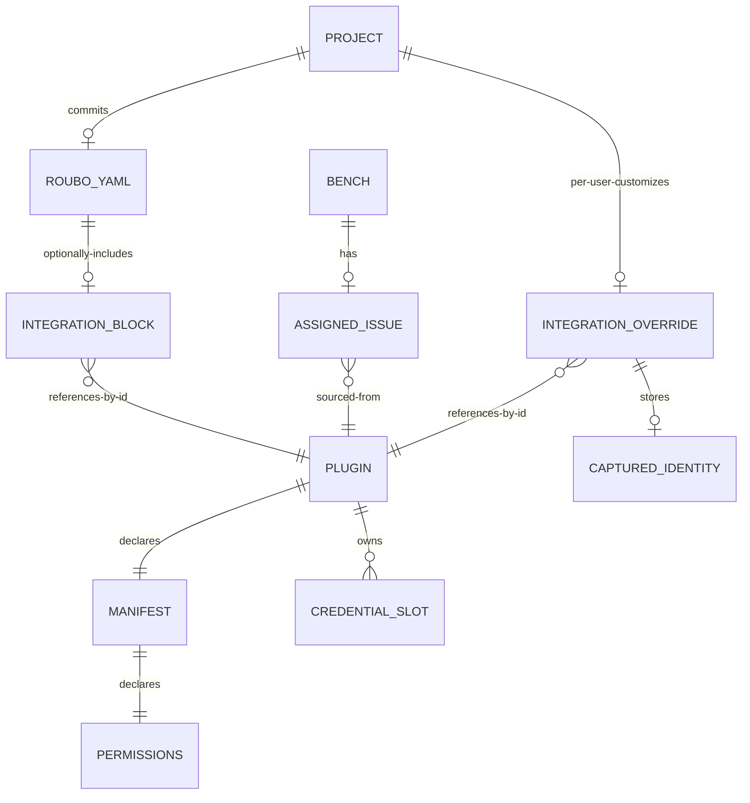

# Architecture: Integration plugins (extensible plugin system, first use case: issue-source integrations)

> Slug: `integration-plugins` · Designed: 2026-05-21

> **Platform scope.** This design targets macOS and Linux only. Roubo does not support Windows as a host platform (licensing constraint surfaced 2026-05-21, recorded in `context.md` and `decisions-log.md`). All references to Windows-specific CLIs (PowerShell, `cmdkey`, DPAPI), Windows-only paths, and Windows CI runners have been removed from this design. The supported-platforms matrix is macOS plus Linux (desktop and headless variants).

## Context and constraints

Roubo today reads issues only from GitHub.com through `server/services/github.ts` and `server/services/github-auth.ts`, with the OAuth token stored in plaintext at `~/.roubo/auth.json`. Enterprise developers on GitHub Enterprise or self-hosted Jira are blocked at evaluation. This slug introduces an extensible plugin runtime, three bundled integration plugins (GitHub.com, GitHub Enterprise, self-hosted Jira), a published SDK, and a fully automatic migration of every existing GitHub.com project. The runtime is the load-bearing piece: it is designed so the planned AI-agent and project-component plugin slugs can attach to the same host API without a major-version bump.

The architecture is constrained by five hard rules from context and PRD. First, no native modules anywhere, which forces the OS keyring to a pure-JS shellout to `security` (macOS) and `secret-tool` (Linux). Second, plugins never run inside the Roubo server process; each runs as a `child_process.spawn`ed Node script with JSON-RPC over stdio. Third, plugins never bring their own HTTP client; the host owns `host.fetch` and enforces the manifest network allowlist, system proxy (via `EnvHttpProxyAgent` reading `HTTP_PROXY` / `HTTPS_PROXY` / `NO_PROXY`), and per-plugin self-signed-TLS opt-in. Fourth, credentials never touch disk in plaintext, and the legacy `auth.json` is deleted as the final step of migration. Fifth, migration is atomic, all-or-nothing, and idempotent; `state.json` `schemaVersion` is the single commit point.

The supplementary constraints come from existing code shape. `shared/config-schema.ts:235` is `.strict()`, so adding the `integration` block to `roubo.yaml` is a real schema migration that must ship in lockstep with the JSON Schema artifact at `schema/roubo-config.schema.json`. The hard-block on issue dependencies at `server/services/issue-assignment.ts:102` and its UI counterpart at `client/src/components/IssuePickerModal.tsx:91` must flip to soft-warn in lockstep. The `githubRequest` helper at `server/services/github.ts:255` (ETag store, exponential backoff, 30s TTL caches, GraphQL batching, Projects v2 pagination) must be preserved verbatim inside the bundled github.com plugin; re-deriving it is a documented top risk. `host.fetch` must surface raw response headers so the plugin's ETag store and `Retry-After` backoff remain implementable across the RPC boundary.

Feasibility called for two spikes that gate `hostApiVersion` 1.0.0 freeze: Spike A (pure-JS keyring across macOS, Ubuntu desktop, Ubuntu headless) and Spike B (`host.fetch` cache-header fidelity + `githubRequest` rewrite). This design assumes Spike A passes on macOS and Ubuntu desktop, and flags the Ubuntu headless fallback explicitly under `risks_and_alternatives`.

## Existing architecture summary

Files this design touches or directly extends:

- `server/services/process-manager.ts:1` — child-process supervisor with ring-buffered logs, `treeKill` SIGTERM-then-SIGKILL, `stopAllProcesses` on host shutdown. Direct template for `plugin-manager.ts`.
- `server/services/jig-manager.ts:65, :179, :372, :384, :405` — two-tier discovery (bundled + user-installed), per-dir FS watcher with debounced invalidation. Direct template for plugin discovery.
- `server/services/state.ts:49, :91, :162, :206` — `atomicWrite`, `loadState`, `loadSettings` shallow merge, `resolvePermissionsPath` path-traversal guard. Re-used for the per-user override file and migration commit point.
- `server/services/exec.ts:32` — `runCommand` with subprocess timeout and captured I/O. Used by the keyring shellouts (with a passthrough for `DBUS_SESSION_BUS_ADDRESS`).
- `server/services/github.ts:101, :255, :476, :516, :618, :840, :944, :960, :988, :1061` — all of GitHub.com today. Migrates verbatim into `plugins/github-com/` source tree.
- `server/services/github-auth.ts:18, :132, :145` — OAuth state machine, token persistence to `auth.json`. Migrates into `plugins/github-com/`; persistence call sites become the migration source of truth.
- `server/services/issue-assignment.ts:102` — hard-block throw site. Flips to passthrough with `blockedBy` attached to response.
- `server/services/pr-sync.ts:18, :35, :129` — gates on `getGithubToken()`. Re-gated on `project.integration.plugin === "github-com"`.
- `server/services/auto-clear.ts:32, :51` — 30s `setInterval` PR sync. Gated on the github.com integration.
- `server/routes/issues.ts:27, :55, :78, :101, :116, :155` — all delegated to `githubService.*`. Re-delegated to `pluginRuntime.invoke(pluginId, method, args)`.
- `server/routes/auth.ts:14` — GitHub OAuth routes. Stay at this path; proxy through the github.com plugin.
- `shared/config-schema.ts:235` — `.strict()` zod schema for `roubo.yaml`. Gains an optional `integration` block.
- `shared/types.ts:401, :622, :646` — `PersistedBench`, `GitHubIssue`, `AssignedIssue`. Receive `integrationId` + `externalId` with load-time defaulting.
- `client/src/components/IssuePickerModal.tsx:91` — disabled-row treatment for blocked issues. Flips to warn-only chip.
- `client/src/hooks/useProjectItems.ts:4, :15` — single React Query call. Becomes `useInfiniteQuery`.
- `client/src/lib/api.ts` — typed API client; renamed and extended.
- `electron/src/main.ts:127` — `roubo://oauth/github/callback` deep-link handler. Unchanged; remains the github.com plugin's auth surface.

## Proposed components

### Plugin manifest and host-API shared schema

- **Path**: `shared/plugin-manifest.ts` (new), `schema/roubo-plugin.schema.json` (new).
- **Responsibility**: define the zod schema for `roubo-plugin.yaml`, export TypeScript types, and provide a `parseManifest(yamlText, sourcePath)` helper that returns `{ ok: true, manifest } | { ok: false, error }`. Emit a hand-maintained JSON Schema mirror for IDE tooling (matches today's `schema/roubo-config.schema.json` discipline).
- **Reuse vs new**: new module, but cribs the dual-source discipline from `shared/config-schema.ts` + `schema/roubo-config.schema.json`.
- **Public interface**: `PluginManifest` zod schema and TS type with fields: `id` (string, kebab-case), `name` (string), `version` (semver string), `kind` (literal `"integration"`; future kinds added by union widening, not by replacement), `roubo` (semver range; the host-API range the plugin requires), `entry` (relative path to the Node entry script), `description` (string, one-line), `configSchema` (JSON Schema object describing user config), `permissions` (object with four sub-keys: `network.hosts: string[]` (glob patterns); `credentials: { slot: string, scope: "read" | "read-write", description: string }[]`; `filesystem.paths: string[]` (absolute or `~`-prefixed paths beyond the plugin's own dir); `childProcess: { executables: string[] } | false`), and optional `capabilities: { prSync?: boolean }` (declarative capability flags consumed by the host for routing decisions like PR sync gating).
- **Dependencies**: `yaml` (already a dep at `package.json:54`), `zod`.

### Plugin manager (host supervisor)

- **Path**: `server/services/plugin-manager.ts` (new).
- **Responsibility**: discover, load, spawn, supervise, and tear down plugin processes. Owns the registry of `{ pluginId → PluginInstance }`. Enforces the 3-restarts-in-5-minutes window per plugin. Wires plugin stdout/stderr to per-plugin log files. Exposes `invoke(pluginId, method, params)` to routes.
- **Reuse vs new**: new module, but extends the `process-manager.ts:1` pattern (ChildProcess + ring-buffered logs + `treeKill` shutdown) with the addition of (a) JSON-RPC framing, (b) restart-budget tracking, (c) per-plugin log file rotation, (d) lifecycle state machine. Reuses `jig-manager.ts:179` (`resolveJigsForProject`) discovery idiom for two-tier scan (bundled `plugins/` then `~/.roubo/plugins/<id>/`).
- **Public interface**:
  - `initialize(): Promise<void>` — called from `server/index.ts` next to `projectRegistry.initialize()`. Discovers plugins, validates manifests, spawns enabled ones, returns once all spawn attempts complete (success or failure). Never throws; per-plugin failures surface on the Plugins page.
  - `listInstalled(): PluginRecord[]` — returns `{ id, manifest, status: "enabled" | "disabled" | "errored" | "incompatible", source: "bundled" | "git" | "local", lastError?: PluginError, restartHistory: RestartEvent[] }`.
  - `enable(pluginId): Promise<void>` / `disable(pluginId): Promise<void>` — graceful start / stop without host restart. Disable invokes `treeKill(pid, "SIGTERM")` with a 5000ms grace then SIGKILL, matching `process-manager.ts`.
  - `install({ source: { kind: "git", url } | { kind: "local", path } }): Promise<InstallResult>` — clones or validates, parses manifest, returns the manifest and source for the permissions dialog. Does not enable until `acceptInstall(pluginId)` is called.
  - `acceptInstall(pluginId): Promise<void>` — flips the install gate; enables.
  - `uninstall(pluginId): Promise<void>` — only third-party. SIGTERM, then `rm -rf ~/.roubo/plugins/<id>/`, then unregister.
  - `invoke<T>(pluginId, method, params, opts?: { timeoutMs?: number }): Promise<T>` — host-to-plugin RPC. Default 30s timeout. On timeout cancels the in-flight request id without killing the plugin process.
  - `restart(pluginId): Promise<void>` — clears the restart-window counter and re-spawns (per prototype-notes resolution; see open-question response below).
  - `readLogs(pluginId, file: "current" | "previous", lines: number): Promise<LogLine[]>` — backs the in-app log viewer.
  - `shutdown(): Promise<void>` — registered in `server/index.ts` shutdown sequence; calls SIGTERM on every child, awaits exit with 5000ms grace then SIGKILL via `treeKill`. Mirrors `processManager.stopAllProcesses`. POSIX signal semantics on macOS and Linux are sufficient; no platform-specific shutdown handling is required.
- **Dependencies**: `child_process.spawn`, `vscode-jsonrpc` (new dep, zero native deps), `tree-kill` (existing dep), `node:fs/promises`, the credential-store service, the host.fetch service, the manifest schema.

### RPC transport

- **Path**: `server/services/plugin-rpc.ts` (new).
- **Responsibility**: wrap `vscode-jsonrpc`'s `StreamMessageReader` / `StreamMessageWriter` over `proc.stdout` / `proc.stdin`. Provide `createConnection(proc)` returning `{ sendRequest, sendNotification, onRequest, onNotification, dispose }`. Owns Content-Length framing.
- **Reuse vs new**: new, thin wrapper over `vscode-jsonrpc`. We considered hand-rolled framing; rejected because LSP-style framing is the only widely battle-tested approach for Node stdio.
- **Public interface**: `createConnection(proc: ChildProcessByStdio): JsonRpcConnection`.
- **Dependencies**: `vscode-jsonrpc`.

### Host services exposed to plugins (the "host" RPC surface)

The plugin process calls these via the same JSON-RPC channel; the plugin manager dispatches the request method names below to in-host implementations. Methods are prefixed `host.` on the wire to namespace away from plugin-to-host methods.

- **Path**: `server/services/plugin-host-api.ts` (new). Single file binds all `host.*` handlers to a connection at spawn time.
- **Methods**:
  - `host.fetch(url, init)` — see component below.
  - `host.credentials.get(slot)`, `host.credentials.set(slot, value)`, `host.credentials.delete(slot)` — backed by the credential store, scoped to the plugin's manifest-declared slots.
  - `host.logger.info(payload)`, `host.logger.warn(payload)`, `host.logger.error(payload)` — appends to `~/.roubo/plugins/<pluginId>/logs/current.log` with timestamp + level + structured fields.
  - `host.spawn(executable, args, opts)` — only enabled if the manifest declares the executable under `permissions.childProcess.executables`. Returns `{ code, stdout, stderr }`. Internally delegates to `exec.ts:32` (`runCommand`) with a passthrough on env vars needed for keyring access on Linux.
- **Dependencies**: credential store, host fetch, logger, exec service.

### Host fetch (network gateway)

- **Path**: `server/services/plugin-fetch.ts` (new).
- **Responsibility**: serve `host.fetch(url, init)` calls from plugins. Enforce the manifest network allowlist, respect system proxy env vars, apply per-plugin self-signed-TLS opt-in, and return `{ status, headers, body }` with every response header surfaced to the plugin verbatim (so plugin-internal ETag store and `Retry-After` backoff remain implementable).
- **Reuse vs new**: new module. Uses `undici` (built-in to Node 24, no install needed). The Octokit dep at `server/package.json:32` moves into `plugins/github-com/package.json`.
- **Public interface**: `createPluginFetcher(manifest, runtimeConfig): (url, init) => Promise<FetchResult>` where `FetchResult = { status: number, headers: Record<string, string | string[]>, body: ArrayBuffer | string }`. The plugin SDK exposes `host.fetch(url, init)` as the ergonomic wrapper.
- **Network allowlist enforcement**: each `manifest.permissions.network.hosts` glob is compiled at plugin load via `picomatch`-compatible (or hand-rolled, given the small surface) glob matcher; every outbound URL is parse-validated against the host portion. Denials are returned as a structured `{ error: "permission-denied", host, reason }` envelope, and an `info` line is appended to the plugin log file (NFR-001).
- **Per-plugin undici dispatcher**: built once per `(pluginId, configHash)` tuple. `EnvHttpProxyAgent` covers system proxy by reading `HTTP_PROXY`, `HTTPS_PROXY`, and `NO_PROXY` from the host process env. This is the standard proxy convention on macOS and Linux and requires no further OS integration. Self-signed-TLS opt-in is implemented as `new Agent({ connect: { rejectUnauthorized: false } })` on a dispatcher that is _only_ installed when the user has explicitly toggled the per-plugin "Allow self-signed TLS" checkbox in the configure dialog. Re-toggling rebuilds the dispatcher; the in-flight requests on the old dispatcher are not cancelled (a 30s drift window is acceptable).
- **Header surfacing**: `undici` exposes all response headers including `ETag`, `Retry-After`, `X-RateLimit-*`, `X-GitHub-Request-Id`. The fetcher returns them as a flat `Record<string, string | string[]>` (lower-cased keys; arrays preserved for multi-value headers) so the plugin's GitHub ETag-aware request layer continues to work.
- **Body framing**: response body is sent over RPC as `ArrayBuffer` for binary or as `string` for `Content-Type: text/* | application/json | application/xml`. There is no body streaming this slug; the use cases are issue-list JSON, all small. Future plugin kinds that need streaming get a separate `host.fetchStream` method in a 1.x minor.
- **Dependencies**: `undici`, the manifest schema (to read `network.hosts`).

### Credential store

- **Path**: `server/services/credential-store.ts` (new).
- **Responsibility**: implement `get(slot)` / `set(slot, value)` / `delete(slot)` backed by the OS keyring via pure-JS shellouts.
- **Reuse vs new**: new module. Internally uses `exec.ts:32` (`runCommand`) for shellouts. On Linux we pass through `DBUS_SESSION_BUS_ADDRESS` and `XDG_RUNTIME_DIR` (`cleanEnv` currently strips them; the credential store calls `runCommand` with an env extension or bypasses `cleanEnv` for these specific vars).
- **Supported-platform matrix**: macOS and Linux only (Windows is out of scope per the platform constraint at the top of this document).
- **Platform implementations**:
  - macOS: `security add-generic-password -a <slot> -s roubo-plugins -w <secret> -U` to write; `security find-generic-password -a <slot> -s roubo-plugins -w` to read.
  - Linux: `secret-tool store --label='roubo-<pluginId>-<slot>' service roubo-plugins account <slot>` reading the password from stdin (so it never appears in argv). `secret-tool lookup service roubo-plugins account <slot>` to read.
- **Slot naming**: slots are namespaced `<pluginId>/<slotName>` at the storage layer to prevent slot-name collisions across plugins. The credential service rejects `get`/`set` requests whose `<slotName>` is not declared in the manifest's `permissions.credentials[].slot` array, providing the cooperative-enforcement boundary noted in feasibility.
- **Headless-Linux behaviour (open spike)**: on headless Ubuntu (no graphical session, no `gnome-keyring-daemon` running by default), `secret-tool` shellouts will fail. The credential store hard-fails at first credential read/write with `CredentialStoreError("keyring-unavailable", ...)`, surfacing the failure to the calling plugin (which logs it). The PRD constraint is "no plaintext on disk," so we do not silently fall back to a plaintext file. The recommended user recipe, which is documented in full in `server/services/credential-store.README.md`:

  ```bash
  # one-time install
  sudo apt-get install -y libsecret-tools gnome-keyring dbus-user-session

  # per shell session (interactive)
  export $(dbus-launch)
  printf '\n' | gnome-keyring-daemon --unlock --components=secrets
  gnome-keyring-daemon --start --components=secrets

  # or as a one-shot wrapper for headless CI / servers
  dbus-run-session -- sh -c 'printf "\n" | gnome-keyring-daemon --unlock --components=secrets && roubo'
  ```

  Whether this recipe is sufficient for typical headless adopters is the remaining open question; this is gated by Spike A and tracked under `risks_and_alternatives`.

- **Public interface**: `get(pluginId, slot): Promise<string | null>`, `set(pluginId, slot, value): Promise<void>`, `delete(pluginId, slot): Promise<void>`, `listSlotsForPlugin(pluginId): Promise<string[]>`.
- **Dependencies**: `exec.ts:32`.

### Plugin SDK package

- **Path**: `sdk/` (new npm workspace), published as `@roubo/plugin-sdk`.
- **Responsibility**: lets a plugin author write `import { definePlugin, host } from "@roubo/plugin-sdk"`. Encapsulates the RPC binding so the plugin author writes plain async methods; the SDK turns them into JSON-RPC request handlers. The host's `host.fetch` / `host.credentials.get` / `host.logger` show up as imports the plugin calls; under the hood, the SDK proxies them as JSON-RPC requests to the host.
- **Reuse vs new**: new workspace; depends on `vscode-jsonrpc` and the manifest types from `shared/plugin-manifest.ts`.
- **Public interface**:
  - `definePlugin({ listSourceCandidates, listIssues, getIssue, getAvailableTransitions, applyTransition, assignIssue, unassignIssue, validateConfig, getCurrentUser, listIssueTypes? }): void` — the plugin author calls this once at entry; the SDK starts the RPC reader and binds the handlers.
  - `host.fetch(url, init): Promise<{ status, headers, body }>`.
  - `host.credentials.get(slot)`, `host.credentials.set(slot, value)`.
  - `host.logger.info(payload)`, `host.logger.warn(payload)`, `host.logger.error(payload)`.
  - `host.spawn(executable, args, opts)` (only available if manifest declares it).
- **Versioning**: `hostApiVersion` semver lives in the SDK as an exported constant; the SDK's `package.json` version is the same as `hostApiVersion`. Major bumps require the SDK and host to ship together. 1.x bumps stay backwards compatible (FR-005).
- **Dependencies**: `vscode-jsonrpc`, `shared/plugin-manifest.ts`.

### Bundled plugins

- **Path**: `plugins/github-com/`, `plugins/github-enterprise/`, `plugins/jira-server/`. Each is its own npm workspace, with `roubo-plugin.yaml` at the top, `package.json`, `src/index.ts`, and tests.
- **Responsibility**: implement the integration. Each plugin's `src/index.ts` calls `definePlugin({...})` from the SDK.
- **Reuse vs new**: github-com is a verbatim move of `server/services/github.ts` and `server/services/github-auth.ts` content; the `githubRequest` helper at `server/services/github.ts:255`, `buildBlockingQuery` at `:476`, `fetchBlockingRelationships` at `:516`, the Projects v2 pagination at `:840`, `fetchIssueTypes` at `:960`, `fetchOpenPullRequestByBranch` at `:1061`, and `fetchLinkedPullRequests` at `:618` all move into the plugin source tree unchanged in behaviour (only the `Octokit` constructor and the token source change: `getOctokit()` reads from `host.credentials.get("github-oauth-token")` instead of `auth.json`). github-enterprise reuses the same code paths with a configurable instance URL. jira-server is new code; ADF-to-markdown walker is hand-rolled (no `@atlaskit/adf-utils` dep).
- **Capabilities**: github-com and github-enterprise declare `capabilities.prSync: true`; jira-server omits it. The host gates `pr-sync.ts` and `auto-clear.ts` on this flag.
- **Dependencies**: SDK, plugin-local deps (`octokit` for GitHub plugins; no extras for Jira).

### Per-user override store

- **Path**: `server/services/integration-overrides.ts` (new). On-disk: `~/.roubo/integrations/<projectId>.yaml` (one file per project, YAML for visual parity with `roubo.yaml`).
- **Responsibility**: load and write the per-user override. Provide deep-merge against the committed `roubo.yaml` integration block. Provide path-traversal-safe resolution mirroring `resolvePermissionsPath` at `state.ts:206`.
- **Reuse vs new**: new module. Uses `atomicWrite` from `state.ts:49`. Path-traversal guard reuses the pattern from `resolvePermissionsPath`.
- **Public interface**:
  - `loadOverride(projectId): Promise<IntegrationOverride | null>` — null on missing file.
  - `saveOverride(projectId, override): Promise<void>` — `atomicWrite`s YAML.
  - `deleteOverride(projectId): Promise<void>`.
  - `effectiveIntegrationConfig(committed, override): IntegrationConfig` — deep-merge; **arrays REPLACE** at every nesting level (per decisions-log); objects merge per field; explicit `null` in override means "delete this field."
- **Deep merge implementation**: hand-rolled in `shared/deep-merge.ts` (new). Library alternatives like `lodash.merge` were considered; rejected because (a) `lodash.merge` concats arrays by default, which is the wrong semantics, and (b) we already avoid lodash in the codebase. The hand-rolled implementation is ~30 lines: walk both shapes recursively; for each key, if both sides are plain objects, recurse; if either side is an array, the override side wins (or both-absent falls through); for primitives, override wins if present.
- **File shape**: `{ schemaVersion: 1, integration: { plugin?, instance?, sources?, advanced?, capturedUserId? } }`. `capturedUserId` is the value returned from `plugin.getCurrentUser` at last successful `validateConfig`.
- **Dependencies**: `yaml`, `state.ts:49`.

### `roubo.yaml` schema additions

- **Path**: `shared/config-schema.ts:235` (modified), `schema/roubo-config.schema.json` (modified in lockstep).
- **Responsibility**: introduce the optional `integration` block.
- **Reuse vs new**: extension of the existing zod schema. The root remains `.strict()`; the `integration` block is the only addition.
- **Public interface (additions only)**: an `integration` object with all fields optional: `plugin: string` (plugin id), `instance?: string` (URL for plugins that have an instance, like GHE / Jira), `sources?: unknown` (shape is plugin-defined; we store whatever `listSourceCandidates` returns selections for, as opaque-to-roubo JSON), `advanced?: unknown` (plugin-defined advanced settings, e.g. Jira link-type names; opaque-to-roubo). Validating the inner `sources` and `advanced` against the plugin's `configSchema` happens after the active plugin is loaded; the roubo.yaml zod schema only enforces "looks like an object." This is consistent with how Roubo treats jig frontmatter today.
- **Dependencies**: zod.

### Migration service

- **Path**: `server/services/migrate.ts` (new).
- **Responsibility**: detect a pre-plugin `~/.roubo/` (`schemaVersion` missing or 0 in `state.json`) and run the atomic migration. Idempotent. Surfaces structured success / failure to the host for the banner.
- **Reuse vs new**: new module; uses `atomicWrite` from `state.ts:49` extensively. Re-uses `loadProjects` from `project-registry`.
- **Atomic ordering (single commit point on `state.json.schemaVersion`)**:
  1. Detect: read `state.json`; if `schemaVersion >= 1`, return `{ already-migrated: true }`.
  2. Read `~/.roubo/auth.json` (token + scopes). If absent and no projects reference github.com, set `schemaVersion: 1` and exit (the user is a fresh install).
  3. For each registered project that today has a configured GitHub.com source: build the per-user override YAML in memory (`integration.plugin: "github-com"`, `integration.sources: { projectV2: <existing project number>, repos: [] }`, `integration.capturedUserId: <viewer login>`).
  4. Write every per-user override file via `atomicWrite` to `~/.roubo/integrations/<projectId>.yaml`. Each write is atomic; the cross-file sequence is not, but the commit marker is below.
  5. Write the migrated token to the OS keyring under slot `github-com/oauth-token` via the credential store. The token in `auth.json` is left on disk for now.
  6. Bump `state.json.schemaVersion` to `1` via `atomicWrite`. **This is the single commit point.** Up to this line, a crash on next boot causes the migration to re-run; the credential-store write is idempotent (overwrites the same slot), the override writes are idempotent (atomicWrite-overwrite-same-content).
  7. After the bump, unlink `~/.roubo/auth.json`. If unlink fails (rare), the bump is already committed; on next boot we observe `schemaVersion === 1 && auth.json present` and re-attempt the unlink. Document this in the boot path.
- **One-time banner**: write a `state.json.migrationBannerDismissed` boolean (default false). Banner shows until dismissed. Across Roubo upgrades, once dismissed, stays dismissed.
- **Public interface**: `run(): Promise<{ migrated: boolean, banner: "success" | "rolled-back" | null }>`.
- **Dependencies**: credential store, project registry, `state.ts`.

### Plugins API routes

- **Path**: `server/routes/plugins.ts` (new), wired under `/api/plugins` in `server/index.ts`.
- **Responsibility**: thin HTTP layer over `plugin-manager.ts`.
- **Reuse vs new**: new router; mirrors the layered structure of existing `server/routes/*.ts`.
- **Endpoints**:
  - `GET /api/plugins` — `pluginManager.listInstalled()`.
  - `POST /api/plugins/install` — body `{ source: { kind: "git", url } | { kind: "local", path } }`. Returns the manifest + permissions for the install permissions dialog. Plugin is not yet enabled.
  - `POST /api/plugins/:pluginId/accept` — finalize install; enable plugin.
  - `DELETE /api/plugins/:pluginId` — uninstall (third-party only; 409 on bundled).
  - `POST /api/plugins/:pluginId/enable`, `POST /api/plugins/:pluginId/disable`.
  - `POST /api/plugins/:pluginId/restart` — clears restart-window counter and re-spawns.
  - `GET /api/plugins/:pluginId/logs?file=current|previous&lines=500`.
- **Dependencies**: `plugin-manager.ts`.

### Integration-config API routes (per-project)

- **Path**: `server/routes/integration.ts` (new), wired under `/api/projects/:projectId/integration`.
- **Responsibility**: read the effective integration config; write the per-user override; run `validateConfig` and `getCurrentUser` round-trips.
- **Reuse vs new**: new router; collaborates with `integration-overrides.ts` and `plugin-manager.ts`.
- **Endpoints**:
  - `GET /api/projects/:projectId/integration` — returns `{ committed, override, effective }`. `committed` comes from the project's `roubo.yaml`; `override` from the per-user override store; `effective` is the deep-merged result.
  - `PUT /api/projects/:projectId/integration` — writes the per-user override only. Never writes back to `roubo.yaml`.
  - `POST /api/projects/:projectId/integration/test` — body `{ config }`. Proxies to `pluginManager.invoke(pluginId, "validateConfig", config)` and `getCurrentUser(config)`. Returns `{ ok: true, identity: { externalId, displayName } } | { ok: false, error: PluginError }`.
  - `GET /api/projects/:projectId/integration/sources` — proxies `listSourceCandidates`.
  - `POST /api/projects/:projectId/integration/transition` — body `{ externalId, transitionName }`; proxies `applyTransition`.
  - `POST /api/projects/:projectId/integration/assign` — body `{ externalId }`; uses captured identity; proxies `assignIssue`.
  - `POST /api/projects/:projectId/integration/unassign` — body `{ externalId }`; proxies `unassignIssue`.
- **Dependencies**: `plugin-manager.ts`, `integration-overrides.ts`, `project-registry`.

### Issues route re-shape (existing routes, modified)

- **Path**: `server/routes/issues.ts:27, :55, :78, :101, :116, :155` (modified).
- **Responsibility**: change `listIssues`-equivalent endpoints to be paginated and integration-routed. Today's GitHub-direct calls become `pluginManager.invoke(activePluginId, "listIssues", { cursor, pageSize, filters })`. Response shape: `{ items: NormalizedIssue[], nextCursor: string | null }`.
- **Reuse vs new**: in-place edit of the existing router. The pre-existing branch-name slugification, conflict resolution, jig injection in `issue-assignment.ts` stays integration-agnostic and unchanged. `checkIssueDependencies` at `issue-assignment.ts:102` flips to passthrough and attaches `blockedBy` on the response payload.
- **Endpoints affected**:
  - `GET /api/projects/:projectId/issues` — was returning `GitHubIssue[]`; now `{ items: NormalizedIssue[], nextCursor }`.
  - `GET /api/projects/:projectId/issues/:externalId` — was numeric id; now string id.
  - `GET /api/projects/:projectId/project-items` — collapses into `/api/projects/:projectId/issues` since the picker is now driven by the plugin's source selection.
  - `POST /api/projects/:projectId/benches/:id/assign-issue` — body's `issueNumber: number` becomes `externalId: string`; the legacy `issueNumber` is accepted for one release as a fallback (`externalId = String(issueNumber)`) and is then dropped.
- **Dependencies**: `plugin-manager.ts`.

### Source picker (host-rendered)

- **Path**: `client/src/components/SourcePicker.tsx` (new), `client/src/components/MultiList.tsx` (new; or fold into `SourcePicker`), `client/src/components/CategorizedMultiList.tsx` (new).
- **Responsibility**: render the declarative source picker shape returned by `listSourceCandidates`. Switches on `{ shape: "multi-list" } | { shape: "categorized-multi-list" }`.
- **Reuse vs new**: new top-level component; **reuses** the existing `client/src/components/MultiSelect.tsx` primitive for the actual selection list. The categorized variant wraps it in React Aria `Tabs`.
- **Public interface**: a React component accepting `{ projectId, pluginId, value, onChange }`. Internally calls `GET /api/projects/:projectId/integration/sources` once on open. Pagination: always-all in this slug per the open-question resolution below; the response shape includes an optional `nextCursor` field so 1.x plugins can opt into pagination without a host change.
- **Dependencies**: React Aria `Tabs`, the existing `MultiSelect.tsx`.

### Plugins page (client)

- **Path**: `client/src/components/PluginsPage.tsx` (new), `client/src/components/PluginCard.tsx` (new), `client/src/components/InstallPluginDialog.tsx` (new), `client/src/components/InstallPermissionsDialog.tsx` (new), `client/src/components/PluginConfigureDialog.tsx` (new), `client/src/components/PluginLogViewer.tsx` (new).
- **Responsibility**: implement screens 1, 2, 3, 4, 5 from `prototype/mockups.md`.
- **Reuse vs new**: new components; use React Aria `Dialog`, `Button`, `TextField`, `Checkbox`, `Tabs`, `RadioGroup` per project conventions. `PluginLogViewer` uses a `Dialog` (Roubo does not ship a `Drawer` primitive today, see open-question response below).
- **Public interface**: routed at `/settings/plugins`.
- **Dependencies**: React Aria Components, React Query, the typed API client.

### Issue source tile (client)

- **Path**: `client/src/components/IssueSourceTile.tsx` (new), `client/src/components/SwitchIntegrationDialog.tsx` (new).
- **Responsibility**: implement screens 6 and 7. Mounts on the project detail page next to existing tiles.
- **Reuse vs new**: new components. Reuse `PluginConfigureDialog.tsx` for the inner Configure flow.
- **Dependencies**: React Aria Components, React Query.

### Bench-view write-back controls (client)

- **Path**: `client/src/components/IssueTransitionDropdown.tsx` (new), `client/src/components/AssignIssueControl.tsx` (new).
- **Responsibility**: implement screens 10 and 11. Mount inside the bench view next to the assigned issue display.
- **Reuse vs new**: new components. Optimistic UI update on click; on error, revert + inline structured error from the plugin (see open-question response below).
- **Dependencies**: React Aria Components, React Query mutations.

### Soft-block warning banner + IssuePickerModal flip

- **Path**: `client/src/components/SoftBlockBanner.tsx` (new); `client/src/components/IssuePickerModal.tsx:91` (modified).
- **Responsibility**: implement screen 12. The banner is informational; bench creation proceeds. The `IssuePickerModal` flips the disabled-row treatment to a warn-only chip on the same row, keeping the `Lock` icon as a visual cue.
- **Reuse vs new**: new banner component; in-place edit of `IssuePickerModal.tsx`. The server flip is at `server/services/issue-assignment.ts:102` and changes from `throw ServiceError(409, ...)` to attaching `{ blockedBy }` on the response payload. Existing tests at `server/services/issue-assignment.test.ts` and `client/src/components/IssuePickerModal.test.tsx` (if present) flip in lockstep.
- **Dependencies**: none.

### Missing-plugin prompt + install source resolution

- **Path**: `client/src/components/MissingPluginDialog.tsx` (new).
- **Responsibility**: implement screen 14. Resolution strategy for the install source: see the open-question response below.
- **Reuse vs new**: new dialog; uses React Aria `Dialog`, `TextField`.
- **Install source hint**: the architecture's recommended resolution is **(a) extend `roubo.yaml` `integration` block to optionally allow a `source` hint** per plugin, e.g. `integration.pluginSource: "https://github.com/example/roubo-plugin-linear"`. This is a single optional string, not a separate lock file. Rationale below.
- **Dependencies**: React Aria, the typed API client.

### Migration banner (client)

- **Path**: `client/src/components/MigrationBanner.tsx` (new).
- **Responsibility**: implement screen 13. Reads `state.json.migrationBannerDismissed` via a `GET /api/migration/status` endpoint.
- **Reuse vs new**: new component. Top-of-shell banner placement.
- **Dependencies**: React Query.

### Active-bench "previous integration" badge

- **Path**: `client/src/components/PreviousIntegrationBadge.tsx` (new), `client/src/components/BenchDetail.tsx` (modified).
- **Responsibility**: screen 15. Renders when `bench.assignedIssue.integrationId !== project.effectiveIntegration.plugin`. Source-sync controls inside the bench are visibly disabled.
- **Reuse vs new**: new badge; in-place edit of the bench detail to read the new field.
- **Dependencies**: none.

## Data model

### Type additions

```ts
// shared/integration-types.ts (new)
export interface NormalizedIssue {
  integrationId: string;
  externalId: string;
  externalUrl: string;
  title: string;
  body: string | null;
  currentState: string;
  allowedTransitions: string[];
  assignees: Array<{ externalId: string; displayName: string }>;
  labels: string[];
  issueType: string | null;
  blocks: string[]; // externalId values
  blockedBy: string[]; // externalId values
  updatedAt: string; // ISO-8601
  raw: unknown; // plugin-scoped opaque payload, never persisted beyond active bench
}

export interface SourceCandidatesResponse {
  shape: "multi-list" | "categorized-multi-list";
  items?: SourceCandidateItem[]; // multi-list
  categories?: Array<{
    id: string;
    label: string;
    items: SourceCandidateItem[];
  }>; // categorized-multi-list
  nextCursor?: string | null; // reserved for future pagination; v1 plugins return undefined
}

export interface SourceCandidateItem {
  externalId: string;
  label: string;
  sublabel?: string;
  icon?: "repo" | "project" | "board" | "epic" | "filter";
}

export interface IntegrationConfig {
  plugin: string;
  pluginSource?: string; // optional install-source hint per roubo.lock-equivalent decision
  instance?: string;
  sources?: unknown;
  advanced?: unknown;
  capturedUserId?: { externalId: string; displayName: string };
}
```

### Modifications

```ts
// shared/types.ts (modify in place)
export interface AssignedIssue {
  // legacy: kept for one release for backwards compat; load-time defaulting fills externalId
  number?: number;
  integrationId: string; // NEW: defaults to "github-com" on load if missing
  externalId: string; // NEW: defaults to String(number) on load if missing
  title: string;
  body?: string | null;
  currentState?: string;
  allowedTransitions?: string[];
  blockedBy?: Array<{ externalId: string; title: string }>; // shape change: numeric → string
  linkedPullRequests?: Array<{ repoFullName: string; number: number }>; // GitHub-only, unchanged
}

export interface PersistedState {
  benches: PersistedBench[];
  schemaVersion?: number; // NEW: 0 (or missing) = pre-plugin; 1 = post-migration
  migrationBannerDismissed?: boolean; // NEW
}
```

### File-system additions

```
~/.roubo/
├── auth.json                          (deleted by migration)
├── projects.json                      (unchanged)
├── state.json                         (gains schemaVersion + migrationBannerDismissed)
├── permissions/<projectId>.json       (existing pattern; unchanged)
├── integrations/<projectId>.yaml      (NEW: per-user override store)
└── plugins/<pluginId>/                (NEW: third-party plugin install directory)
    ├── roubo-plugin.yaml
    ├── package.json
    ├── ... plugin source ...
    └── logs/
        ├── current.log
        └── previous.log
```



## Sequence flows

### Plugin lifecycle state machine

```mermaid
stateDiagram-v2
    [*] --> discovered: scan plugins/ and ~/.roubo/plugins/
    discovered --> incompatible: hostApiVersion mismatch
    discovered --> invalid: manifest invalid
    discovered --> disabled: user previously disabled
    discovered --> spawning: enabled at host start
    spawning --> enabled: handshake ok
    spawning --> errored: spawn failed
    enabled --> stopping: user clicks Disable or host shutdown
    enabled --> restarting: child process exit code != 0
    restarting --> spawning: under 3-in-5-minutes budget
    restarting --> errored: budget exhausted
    errored --> spawning: user clicks Restart (counter clears)
    stopping --> disabled
    disabled --> spawning: user clicks Enable
    invalid --> [*]: surfaced on Plugins page; not loaded
    incompatible --> [*]: surfaced on Plugins page; not loaded
```



### Primary flow: paginated listIssues

```mermaid
sequenceDiagram
    participant UI as React (IssueQueuePanel)
    participant API as /api/projects/:id/issues
    participant PM as plugin-manager
    participant PR as plugin-rpc
    participant Plugin as bundled plugin (child proc)
    participant Host as host.fetch (in-host)
    participant Remote as Jira/GitHub

    UI->>API: GET ?cursor=&pageSize=50
    API->>PM: invoke(pluginId, "listIssues", {cursor, pageSize, filters})
    PM->>PR: sendRequest("listIssues", params, timeout=30s)
    PR->>Plugin: JSON-RPC framed over stdin
    Plugin->>Plugin: build remote URL, derive headers (If-None-Match)
    Plugin->>PR: sendRequest("host.fetch", {url, init})
    PR->>Host: dispatch
    Host->>Host: enforce manifest allowlist
    Host->>Remote: undici fetch (proxy, TLS opt-in applied)
    Remote-->>Host: 200 + ETag/Retry-After/RateLimit headers
    Host-->>PR: {status, headers, body}
    PR-->>Plugin: result
    Plugin->>Plugin: cache ETag, normalize, build nextCursor
    Plugin-->>PR: {items, nextCursor}
    PR-->>PM: result
    PM-->>API: result
    API-->>UI: {items, nextCursor}
    UI->>UI: append page; useInfiniteQuery sets next page param
```

### Migration sequence (atomic, idempotent)

```mermaid
sequenceDiagram
    participant Boot as server/index.ts
    participant Mig as migrate.run()
    participant State as state.ts (atomicWrite)
    participant Cred as credential-store
    participant FS as fs (unlink auth.json)

    Boot->>Mig: run()
    Mig->>State: read state.json
    alt schemaVersion >= 1
        Mig-->>Boot: { migrated: false, already up to date }
    else
        Mig->>FS: read auth.json
        loop each github.com project
            Mig->>State: atomicWrite ~/.roubo/integrations/<projectId>.yaml
        end
        Mig->>Cred: set("github-com", "oauth-token", value)
        Mig->>State: atomicWrite state.json with schemaVersion=1
        Note over State: SINGLE COMMIT POINT
        Mig->>FS: unlink auth.json
        alt unlink failed
            Note over Mig: commit already happened; retry on next boot
        end
        Mig-->>Boot: { migrated: true, banner: "success" }
    end
```

### Source picker render flow

```mermaid
sequenceDiagram
    participant UI as SourcePicker
    participant API as /api/projects/:id/integration/sources
    participant PM as plugin-manager
    participant Plugin as active plugin

    UI->>API: GET
    API->>PM: invoke(pluginId, "listSourceCandidates", {config})
    PM->>Plugin: JSON-RPC
    Plugin-->>PM: { shape: "multi-list" | "categorized-multi-list", items|categories, nextCursor? }
    PM-->>API: result
    API-->>UI: SourceCandidatesResponse
    UI->>UI: switch on shape; render MultiList or Tabs(MultiList per tab)
```

## Integration points

- **`/api/projects/:projectId/issues` and siblings** — `server/routes/issues.ts:27, :55, :78, :101, :116`. Re-routed through `pluginManager.invoke(activePluginId, "listIssues", {...})`. Pagination shape change ripples to `client/src/hooks/useProjectItems.ts:4` (becomes `useInfiniteQuery` keyed by `["issues", projectId, integrationId, filters]`) and to `client/src/components/IssueQueuePanel.tsx:47` + `client/src/components/IssuePickerModal.tsx:131` (consume `.items`, add "load more").
- **`/api/auth/github/*`** — `server/routes/auth.ts:14`. Stays at this path; the routes call into the bundled github-com plugin via `pluginManager.invoke("github-com", "oauthStart" | "oauthExchange" | "oauthStatus", ...)`. The bundled github-com plugin's RPC surface includes these GitHub-specific methods alongside the standard integration contract. The Electron deep-link handler at `electron/src/main.ts:127` is unchanged; the callback URL `roubo://oauth/github/callback` remains the github-com plugin's auth surface. Future plugins that need deep links would get `roubo://oauth/<pluginId>/callback` and a prefix-dispatch on the Electron side. Out of scope this slug.
- **`/api/projects/:projectId/issue-types`** — `server/routes/projects.ts:168`. Re-routed to `pluginManager.invoke(activePluginId, "listIssueTypes", {})`. The existing `/api/projects/:projectId/jigs/issue-type-mappings` endpoints (per CLAUDE.md) continue to work unchanged at the persistence layer (`Record<string, string>`); the issueType strings are now plugin-sourced.
- **`/api/projects/:projectId/benches/:id/assign-issue`** — `server/routes/issues.ts:155`. The branch-name slugification, conflict resolution, jig injection stay integration-agnostic. Body shape changes `issueNumber: number` → `externalId: string`; the legacy `issueNumber` is accepted for one release.
- **`server/services/pr-sync.ts:18, :35, :129`** — gates flip from `!githubService.getGithubToken()` to `project.effectiveIntegration.plugin !== "github-com"` (more precisely: check the active plugin's manifest `capabilities.prSync`).
- **`server/services/auto-clear.ts:32, :51`** — same gate; classification short-circuits to "blocked: integration does not support PR-driven clear" for non-github benches.
- **`server/services/issue-assignment.ts:102`** — flips from `throw ServiceError(409, ...)` to attaching `{ blockedBy }` on the response. The `enforceIssueDependencies` toggle (`project-registry.ts:215`) now only controls whether the banner shows.
- **`client/src/components/IssuePickerModal.tsx:91`** — disabled-row treatment becomes a warn-only chip with `Lock` icon retained for visual cue; `aria-disabled` and the no-onPress fall-through are removed.
- **`shared/config-schema.ts:235`** — `.strict()` zod gains an optional `integration` block. JSON Schema artifact at `schema/roubo-config.schema.json` updated in lockstep in the same PR (this is the no-partial-rollout-window risk called out in feasibility).
- **`server/index.ts`** — boot sequence gains a `pluginManager.initialize()` call adjacent to `projectRegistry.initialize()`, plus a `migrate.run()` call BEFORE `pluginManager.initialize()` so the migration's `state.json` `schemaVersion` bump is visible. Shutdown sequence gains `pluginManager.shutdown()` before `processManager.stopAllProcesses()`.
- **Electron `electron/src/main.ts`** — unchanged this slug; only the github.com deep-link path matters and it is hardcoded as today.

## Observability

- **Logs**:
  - Per-plugin stdout / stderr captured by the supervisor and written to `~/.roubo/plugins/<pluginId>/logs/current.log`. Size-based rotation at 5 MB: when `current.log` exceeds 5 MB, it is renamed to `previous.log` (overwriting any existing `previous.log`); a new `current.log` is opened. Two-file rotation; older history is intentionally bounded.
  - Plugin-emitted log lines arrive via `host.logger.{info, warn, error}` and are written to the same `current.log` with the schema `{ ts: ISO-8601, level: "info"|"warn"|"error", pluginId, methodName?, payload }`. The in-app log viewer at `client/src/components/PluginLogViewer.tsx` reads through `GET /api/plugins/:pluginId/logs?file=current|previous&lines=500`.
  - Host-side denial events (network allowlist violations, credential slot mismatches, FS-permission rejections) are appended to the plugin's log file at level `warn` with a stable structured shape: `{ kind: "denied", category: "network"|"credentials"|"filesystem"|"childProcess", detail }`.
- **Metrics**: this slug does not introduce telemetry collection; Roubo is a local dev tool and the lagging indicators are tracked by support volume + incident reports, not metrics. The Plugins page surface acts as the in-app metric for end users: status pill + last-N-restart timeline per card.
- **Traces**: plugin error envelopes carry a stable identifier `<pluginId>.<methodName>` (e.g. `github-com.listIssues`) so a banner shown in the UI can be correlated to a log line. The host injects `request-id` and propagates it to plugins via the JSON-RPC `params._meta.requestId`; plugins include it in `host.fetch` calls so a downstream HTTP error can be traced back to the originating UI event.

## Security considerations

The plugin-host security model is _cooperative_, not adversarial. A malicious plugin running with full Node permissions can still call Node APIs directly (read disk, open sockets, spawn children) by ignoring the SDK. The enforcement boundary is the user-accepted permission set plus the install-source URL the user vetted. Roubo does not ship signing or a trust root in this slug. This must be called out in the SDK author docs and the install permissions dialog (FR-007's footer disclosure).

Within that frame, the threats this design counters:

- **Plugin reaches network outside allowlist.** Mitigated by `host.fetch` being the only ergonomic network API the SDK exposes, plus a manifest-driven allowlist enforced in-host before the undici dispatcher runs. A plugin that imports `node:net` or `node:http` directly bypasses this; the SDK author docs document that doing so violates the permission contract and will cause Roubo to refuse to publish the plugin into community discovery (a non-technical control consistent with the no-signing decision).
- **Plugin reads another plugin's credentials.** Mitigated by namespacing credentials at the storage layer as `<pluginId>/<slotName>` and rejecting `credential-store.get(pluginId, slot)` calls whose `slot` is not in that plugin's manifest. A plugin that shells to `security` (macOS) or `secret-tool` (Linux) directly bypasses this; same SDK-contract-violation framing.
- **Plugin writes outside its directory.** Mitigated by the SDK not exposing FS helpers beyond `host.logger` (which writes to the plugin's own log dir). A plugin that imports `node:fs` directly bypasses this; the manifest's `filesystem.paths` declaration is the user-visible commitment.
- **Plugin survives Roubo shutdown.** Mitigated by `pluginManager.shutdown()` SIGTERM-then-SIGKILL via `tree-kill`. POSIX signal semantics on macOS and Linux carry the parent-exits-takes-down-children behaviour we need; no additional platform plumbing is required. On a non-graceful Roubo crash (SIGKILL of the host), the OS will reparent plugin children to PID 1 and they exit on their next stdio read failure; `process-manager.ts`'s existing patterns cover this.
- **Plugin persistently exfiltrates via the `raw` field.** Mitigated by NFR-004's contract: plugins MUST NOT include PII in `raw` unless functionally required, and Roubo does not persist `raw` to `state.json` beyond the active bench's `assignedIssue`. Persistence of `raw` is in-memory only; the bench's `state.json` writer strips `assignedIssue.raw` before serializing.
- **Third-party plugin installs without user consent.** Mitigated by FR-007's permissions dialog with the install-source URL and full permission list; install only completes on `POST /api/plugins/:pluginId/accept` which is wired to the dialog's primary button.
- **Self-signed TLS opt-in is global rather than per-plugin.** Mitigated by per-plugin undici dispatchers; the self-signed-TLS rejectUnauthorized=false agent is bound to a single plugin instance's dispatcher and never reused. The configure dialog shows the per-plugin checkbox; the Plugins page surfaces "Self-signed TLS enabled" inline on the plugin card whenever it is on. Each toggle change is logged at level `warn` to the plugin's log file (audit trail).
- **Plaintext credentials on disk.** Mitigated by the OS keyring requirement plus the migration that unlinks `auth.json`. The headless-Linux fallback is hard-fail by design (no plaintext file); see `risks_and_alternatives`.

## Risks and alternatives

- **Pure-JS keyring on Linux headless (Spike A).** If `secret-tool` is unavailable on the user's headless Ubuntu box, the design hard-fails the credential write with a directive to install `libsecret-tools` and start a keyring daemon (`gnome-keyring-daemon --start --components=secrets`, optionally wrapped in `dbus-run-session` for fully headless boxes). Alternative considered: a passphrase-encrypted file at `~/.roubo/credentials/<pluginId>.enc` with a master passphrase prompted at first launch; rejected for this slug because it weakens the "no plaintext on disk" constraint and requires UX for passphrase entry that Roubo does not have. Re-open if Spike A surfaces this as a real adoption blocker. `unknown — flag for refinement: Spike A outcome on Ubuntu headless`.
- **`githubRequest` fidelity across the RPC boundary (Spike B).** The plugin's ETag store, primary/secondary rate-limit backoff, and GraphQL batching all depend on `host.fetch` surfacing raw response headers verbatim. Mitigated by the design contract that `host.fetch` returns `{ status, headers, body }` with headers lower-cased and arrays preserved. Verification gate is Spike B before host-API freeze. If a header is dropped (e.g. by undici default sanitization) the plugin's ETag store silently regresses to no-cache; the spike's test plan must explicitly assert `If-None-Match` round-trips return `304` from GitHub.
- **`.strict()` zod root forces schema+migration+code to ship in one PR.** Documented in feasibility. No partial-rollout window. The JSON Schema artifact at `schema/roubo-config.schema.json` must land in the same PR as the zod edit.
- **Plugin process orphans on Roubo hard-crash.** Mitigated by `tree-kill` SIGTERM-then-SIGKILL on graceful shutdown. On a non-graceful host crash, POSIX reparenting to PID 1 plus stdio-read failure causes plugin children to exit on their own; no extra mechanism needed on macOS or Linux.
- **Plugin restart budget hides reliability problems.** Mitigated by surfacing the last-5-restart timeline + most recent error on the Plugins page card so the user sees the flapping signal even if the plugin recovers each cycle.
- **Pagination cache invalidation on manual refresh.** Mitigated by React Query's `invalidateQueries(["issues", projectId, integrationId])` resetting the infinite query; the UI returns to page 1 on a manual refresh. Documented in NFR-005's accept criteria.
- **Soft-block migration changes UX expectations.** Mitigated by the one-time migration banner (screen 13) and updated tests at `server/services/issue-assignment.test.ts` + `client/src/components/IssuePickerModal.test.tsx`.
- **No tarball install format.** Rejected per decisions-log; Git URL + local path cover bundled, community, and local-dev workflows. Tarball adds another verification pipeline for no clear win.
- **No version pin in `roubo.yaml`.** Rejected per decisions-log; users run whatever they have installed, and plugins are responsible for backwards compat within their declared `hostApiVersion` range. If this proves painful, a future minor host-API bump can add an optional `minVersion` field without breaking compat.
- **Drawer primitive for log viewer.** Rejected; Roubo does not ship a Drawer today and introducing one for one surface is not justified. The log viewer uses a wide React Aria `Dialog` per screen 5's fallback.
- **Per-plugin live-reload on config change.** Rejected for the safer "restart on credential or instance-URL change; refetch on sources change" pattern. Implementation: the configure dialog's Save action calls `pluginManager.invoke(pluginId, "applyConfig", config)`; if the diff touches credentials or instance, the manager calls `disable(pluginId)` then `enable(pluginId)` before returning. If the diff is sources-only, no restart.
- **Forward-compat: ports / docker as permission categories.** The feasibility doc noted that project-component plugins (a follow-on slug) may need `ports` and `docker` permission categories. This slug's manifest schema is designed so additional permission categories can be added in a 1.x minor (the zod schema's `permissions` object is `.passthrough()`-aware at the category level, and the host treats unknown categories as opt-out). FR-038's paper sketch verifies this before host-API 1.0.0 freeze. `unknown — flag for refinement: paper sketch output may force additional permission categories now rather than later`.
- **Migration banner versioning across Roubo releases.** Once dismissed, never re-shown. Stored as a single boolean `state.json.migrationBannerDismissed`. If a future slug needs to surface a new banner, it adds its own dismissal key; this slug's banner does not carry a version.
- **Optimistic UI for `applyTransition` / `assignIssue` on host crash mid-flight.** Persist nothing; reconcile from source on next refresh. The bench's local UI flips the label optimistically; on error or refresh-detected divergence, the local label is overwritten by the source's truth. Documented in `client/src/components/IssueTransitionDropdown.tsx` and `AssignIssueControl.tsx`.
- **Source picker pagination.** Always-all in this slug. The `SourceCandidatesResponse` shape includes an optional `nextCursor` field so 1.x plugins can opt in. Real-world Jira instances with hundreds of filters get virtualization at the UI level (the `MultiSelect` primitive already virtualizes long lists). Re-evaluate if Spike B's Jira testing surfaces actual instance sizes that break this. `unknown — flag for refinement: source picker pagination needed for very large Jira instances`.
- **Plugin restart-window counter reset on manual Restart.** Confirmed: clicking Restart on an errored card clears the 3-in-5-minutes window and attempts a fresh spawn. This is what users expect from a manual recovery action.

## Closing summary

This design has both `context.md`, `prd.md`, and `feasibility.md` to lean on, plus the prototype mockups; no input file was missing.

**Resolution of the eight open questions from prototype-notes.md:**

1. **`roubo.lock`-equivalent.** Extend the `roubo.yaml` `integration` block with an optional `pluginSource` field (string: Git URL or local path). Rationale: single source of truth, no second file to coordinate, teams that want to lock the source for clones commit it; teams that don't, don't. The missing-plugin prompt prefers `pluginSource` when present and falls back to a manual entry field otherwise.
2. **Per-user override location.** `~/.roubo/integrations/<projectId>.yaml`. YAML for visual parity with `roubo.yaml`; envelope `{ schemaVersion: 1, integration: {...} }`.
3. **Test-connection-success Save-gate.** Tracked in `PluginConfigureDialog.tsx` local React state (`hasTestedSuccessfully: boolean`), reset on any field change. Mentioned and trivial.
4. **Drawer vs Dialog for log viewer.** Wide React Aria `Dialog`. No new Drawer primitive this slug.
5. **Optimistic UI mid-flight crash semantics.** Reconcile from source on next refresh. No persisted in-flight state.
6. **Migration-banner versioning.** Once dismissed, forever. Single boolean `state.json.migrationBannerDismissed`.
7. **Restart-window counter reset on manual Restart.** Yes. Clicking Restart clears the counter.
8. **Source-picker pagination.** Always-all in this slug. Shape carries an optional `nextCursor` for future opt-in.

**Component counts: 18 `proposed_components`, 11 `integration_points`, 15 `risks_and_alternatives`.**

**The single biggest architectural call to sanity-check:** the `host.fetch` design as a transparent header-passthrough rather than a sandboxed wrapper. The plugin sees raw response headers (ETag, Retry-After, rate-limit) and is trusted to use them; the host enforces only the network allowlist, system proxy, and self-signed-TLS opt-in. This is what makes the github.com plugin's existing rate-limit-aware code path implementable across the RPC boundary, but it also means `host.fetch` is closer to a routed-fetch than a sandboxed-fetch. Worth confirming this matches the security mental model under FR-008 and NFR-006.

**`unknown — flag for refinement` markers in this design:**

- Spike A outcome on Ubuntu headless (keyring fallback path; whether the `dbus-run-session` + `gnome-keyring-daemon` recipe is sufficient for typical headless adopters).
- Paper sketch (FR-038) may force `ports` and/or `docker` permission categories now rather than as a 1.x minor.
- Source picker pagination on very large Jira instances (re-evaluate after Spike B Jira testing).

**CI matrix recommendation.** GitHub Actions `pr-check` should run the test matrix on `macos-latest` and `ubuntu-latest` only. No Windows runner. The Ubuntu runner should additionally exercise a headless-keyring smoke test (Spike A deliverable) once the recipe lands.

## Forward compatibility

FR-038 and NFR-011 require a one-page paper sketch verifying that the host API surface designed in this slug can host the planned AI-agent and project-component plugin kinds without a host-API major-version bump. That sketch is the build-time review gate before `hostApiVersion` 1.0.0 is frozen.

The sketch's conclusion: 1.0.0 freeze is safe for both kinds. AI-agent plugins fit the current `host.fetch` / `host.credentials` / `host.logger` surface unchanged, with `host.fetchStream` available as a non-breaking 1.x minor when streaming is needed. Project-component plugins fit the runtime surface unchanged, with new `ports` and `docker` permission categories arriving as a non-breaking 1.x minor when the project-component slug ships. Both follow-up additions are anticipated by the existing `kind`-union and permission-category extensibility design.

See [`forward-compat-sketch.md`](./forward-compat-sketch.md) for the full sketch, including proposed manifest deltas and method sets for each kind.
