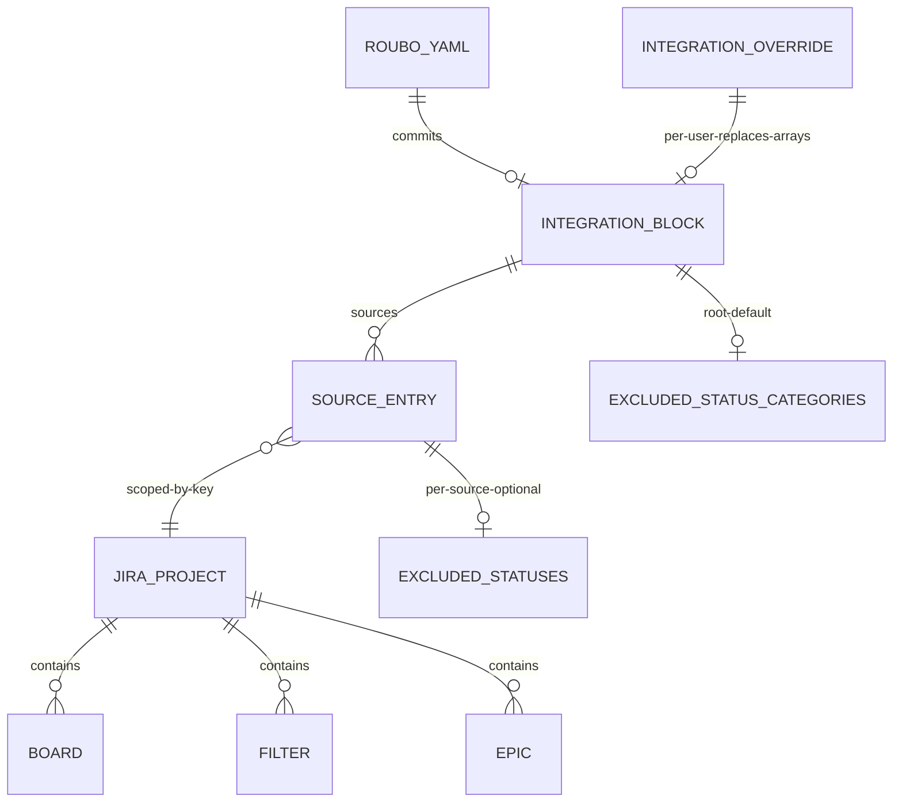

# Architecture: Scalable Jira Source Configuration

> Slug: `jira-sources-scale` · Designed: 2026-06-01

## Context and constraints

The `jira-self-hosted` plugin's source picker does not survive Workday-scale Jira. Today `listSourceCandidates` (`plugins/jira-self-hosted/src/source-picker.ts:53`) does three instance-wide loads in parallel: it lists every board and fans out a `/board/{id}/configuration` call per board (5-concurrent) to resolve backing filters, it pulls epics with a hardcoded `maxResults: 50` and no scoping (`source-picker.ts:130`), and it loads favourite filters in one unpaginated call. Closed and done issues leak into the cut list because `excludedStatuses` is applied client-side after fetch (`client/src/lib/cut-list-filters.ts:91`, called from `IssueQueuePanel.tsx:170`), so they still consume page slots. This redesign reframes selection as project-first, makes every source type reachable through server-side paginated search, and pushes status exclusion into the JQL query.

The hard constraint is reuse, not a fork. The proven async path is `getFacetOptions(facetId, search?)`: client calls `fetchFacetOptions` (`client/src/lib/api.ts:832`), the route validates and forwards `search` (`server/routes/integration.ts:454-492`), the plugin returns options (`plugins/jira-self-hosted/src/plugin.ts:396-412`). The new source-options RPC is modeled exactly on this, extended with a parent `scope` and a `cursor`. The picker shape contract (`shared/integration-types.ts`) is a shared contract also consumed by `github-com`/`ghe`, so every change to it MUST be additive: a new `shape` literal and new optional fields, leaving `multi-list`/`categorized-multi-list` untouched. The roubo.yaml `integration.sources` schema (`shared/config-schema.ts:224-256`) is already an open `Record<category, SourceEntry[]>`; the gap is semantic (nothing encodes "this board belongs to project X"), so the change widens `SourceEntrySchema`, not the envelope. The three-layer + per-source `excludedStatuses` merge (`server/services/integration-overrides.ts:253-305`) already produces a resolved list; the work is to thread it into JQL instead of the client.

This is sized Small (4 sprints / 8 person-weeks). Self-hosted Jira Server/Data Center only; Cloud is out. Raw free-text JQL is out. A clean break on old-shape configs is approved: no migration read path, but an old-shape detection prompt is added so users are told to re-pick rather than seeing a silent empty list. The design assumes feasibility's `build-with-spike` spike passes (DC REST surface for project/board/filter search and `statusCategory` JQL on Workday's version); the spike items that remain genuinely vendor-gated are carried under `risks_and_alternatives` with a default and a one-line note on how the design changes if a spike comes back negative.

## Existing architecture summary

Read-only context the implementer must not re-discover.

- `plugins/jira-self-hosted/src/source-picker.ts:53-174` — current instance-wide Boards/Epics/Filters loader. Boards fan out `/board/{id}/configuration` to resolve filter ids (`:99-113`); epics hardcode `maxResults: 50` (`:130-149`); filters use unpaginated `/filter/favourite` (`:151`).
- `plugins/jira-self-hosted/src/plugin.ts:220-224` — `listSourceCandidates` RPC handler. `:226-283` `listIssues` (builds JQL, paginates via `startAt` cursor, advances per-source watermark only when pagination exhausts, `:272-280`). `:205-218` `getCurrentUser` (`/myself`). `:396-412` `getFacetOptions`/`filterFacets` async-search precedent. `:429-444` `toSourceClauses` + `isJiraSourceKind` (only `filter`/`epic` survive translation today).
- `plugins/jira-self-hosted/src/jql.ts:14-54` — `SourceKind = "filter" | "epic"`; `buildIssueListJql` builds `(<sources>) AND updated >= "<iso>" ORDER BY updated ASC`; `jqlString` (`:49-54`) is the escape helper (backslash then quote).
- `server/routes/integration.ts:418-428` — `listSourceCandidates` route. `:454-492` — `facet-options` route (the exact validate-and-forward template). `:494+` — `PUT .../integration/sources`.
- `client/src/lib/api.ts:820-840` — typed client for sources and facet options.
- `client/src/components/MultiSelect.tsx:14-101` — React Aria `ListBox`+`Popover`, synchronous over a fixed `items` array. Not reusable for async.
- `client/src/components/SourcePicker.tsx:25-81` — renders `multi-list`/`categorized-multi-list` from the plugin shape.
- `client/src/components/PluginConfigureDialog.tsx:220-221` — `Modal max-h-[85vh]` + `Dialog ... overflow-hidden`. The `overflow-hidden` clips an in-flow dropdown (FR-013).
- `shared/integration-types.ts:7-58` — picker shape contract (`SourceCandidatesResponse`, `SourceCandidateItem`, `SourceSelection`).
- `shared/config-schema.ts:224-256` — `SourceEntrySchema` (union of string/number/object), `IntegrationConfigSchema` with `sources: z.record(string, array(SourceEntry))` and root `excludedStatuses`.
- `shared/plugin-manifest-schema.ts:54-69` — `PluginCapabilitiesSchema` (`prSync` only) and `PluginDefaultIntegrationConfigSchema` (`excludedStatuses`).
- `server/services/plugin-source-translation.ts:36` — `CATEGORY_TO_KIND` hardcoded map (`boards`/`filters` → `filter`, `epics` → `epic`).
- `server/services/integration-overrides.ts:253-305` — `applyPerSourceExcludedStatuses` (resolves `sourceLevel ?? rootLevel ?? pluginGlobalDefault`) and `sourceExcludedStatuses`.

## Proposed components

### `getSourceOptions` plugin RPC (jira-self-hosted)

- **Path**: `plugins/jira-self-hosted/src/source-options.ts` (new), wired as a handler in `plugins/jira-self-hosted/src/plugin.ts` next to `getFacetOptions`.
- **Responsibility**: serve scoped, paginated, type-ahead search for the four discoverable categories (`project`, `board`, `filter`, `epic`). One handler, switched on `category`.
- **Reuse vs new**: new module, but it is the direct generalization of `getFacetOptions` (`plugin.ts:396-412`): same `adoptOrRecallConfig` + `ctxFor` preamble, same "return options" contract, extended with `scope` and `cursor`. It supersedes the instance-wide loaders in `source-picker.ts`; `fetchEpicIssues` is rewritten to take a project scope, search term, and cursor rather than being a fixed 50-item dump.
- **Public interface** (RPC method `getSourceOptions`):
  ```ts
  // params
  interface GetSourceOptionsParams {
    category: "project" | "board" | "filter" | "epic";
    scope?: { project?: string[] }; // parent selection; project keys
    search?: string;                // user-typed term, debounced client-side
    cursor?: string | null;         // opaque; encodes Jira startAt
    config?: Record<string, unknown>;
  }
  // result
  interface SourceOptionsResult {
    items: SourceCandidateItem[];   // reuses shared/integration-types item shape
    nextCursor: string | null;
  }
  ```
- **Per-category mapping** (all paginated; each respects `scope.project`):
  - `project` — `GET /rest/api/2/project/search?query=<search>&startAt=<n>&maxResults=<N>`. `scope` ignored (project is the root). Label = project name; sublabel = `KEY` (mono). `externalId` = project key.
  - `board` — `GET /rest/agile/1.0/board?projectKeyOrId=<key>&name=<search>&startAt=<n>`. One request per scoped project, results concatenated and re-cursored. Label = board name; sublabel = `KEY · board #<id> · <scrum|kanban>`. Board filter id is NOT resolved here (resolve-on-pick, see watermark/listIssues); `externalId` = `board:<boardId>`.
  - `filter` — `GET /rest/api/2/filter/search?filterName=<search>&projectId=<id>&startAt=<n>` (replaces `/filter/favourite`). Label = filter name; sublabel = `<owner?> · filter #<id>`. `externalId` = filter id.
  - `epic` — `POST /rest/api/2/search` with JQL `project in (<keys>) AND issuetype = Epic AND resolution = Unresolved AND summary ~ <escaped search> ORDER BY updated DESC`, `startAt`/`maxResults` paginated. Label = epic summary; sublabel = `<epicKey>`. `externalId` = epic key. Removes the 50-cap and instance-wide enumeration.
- **Cursor format**: opaque base64 of `{ startAt, perProject?: Record<projectKey, startAt> }`. For single-stream categories (`project`, `filter`, `epic`) it carries one `startAt`; for `board` (fan-out over scoped projects) it carries per-project offsets so paging never duplicates or drops across projects (NFR-004). `nextCursor` is `null` when every stream is exhausted.
- **Dependencies**: `jira-client.ts` (`jiraFetch`), the new `jqlSearchTerm` escaper (below).

### Active-sprint resolution helper (jira-self-hosted)

- **Path**: `plugins/jira-self-hosted/src/board-resolve.ts` (new).
- **Responsibility**: at `listIssues` time, resolve a `board:<id>` source into its issue JQL. Default = active sprint only; widened = whole board's backing filter.
- **Reuse vs new**: extracts and extends the resolve-on-pick idiom from `source-picker.ts:99-113` (`/board/{id}/configuration` → filter id) and adds active-sprint lookup. Resolution happens per selected board at list time, never while browsing (NFR-004; the browse-time fan-out is gone).
- **Public interface**:
  - `resolveBoardClause(ctx, boardId, mode: "active-sprint" | "whole-board"): Promise<string>` — `whole-board` returns `filter = <backingFilterId>` (via `/board/{id}/configuration`); `active-sprint` returns `sprint in openSprints() AND filter = <backingFilterId>` after confirming the board is scrum via `GET /rest/agile/1.0/board/{id}/sprint?state=active`. Kanban boards have no sprint; they fall back to `whole-board` with a logged note.
- **Dependencies**: `jira-client.ts`.

### JQL builder extension (jira-self-hosted)

- **Path**: `plugins/jira-self-hosted/src/jql.ts` (modified).
- **Responsibility**: support the new source kinds and emit the status-exclusion clause in-query.
- **Reuse vs new**: in-place extension. `SourceKind` widens from `"filter" | "epic"` to `"filter" | "epic" | "project" | "board" | "mine"`. `BuildJqlInput` gains `excludedStatusCategories?: string[]` and `excludedStatuses?: string[]`. The `(<sources>) AND updated >= "<iso>" ORDER BY updated ASC` skeleton and watermark behaviour (FR-014) are unchanged; status exclusion is one more ANDed clause.
- **Public interface** (new `toClause` cases and exclusion clause):
  ```ts
  // toClause additions
  case "project": return `project = ${jqlString(s.externalId)}`;
  case "mine":    return s.scopeProjectKeys?.length
                    ? `(assignee = currentUser() AND project in (${keys}))`
                    : `assignee = currentUser()`;
  case "board":   return s.resolvedClause; // produced by board-resolve.ts at list time
  // status exclusion (FR-009/FR-010), category-first:
  // default → `statusCategory not in ("Done")`
  // user names → `status not in ("Closed","Resolved")` when names are configured
  ```
  Exclusion is appended as a top-level `AND (<exclusion>)` so it applies across the whole union, and so excluded issues never occupy a result page (the watermark math at `plugin.ts:272-280` then counts only issues that survive exclusion).
- **Dependencies**: `jqlString` (`:49-54`), the new `jqlSearchTerm` escaper.

### JQL injection hardening (jira-self-hosted)

- **Path**: `plugins/jira-self-hosted/src/jql.ts` (modified, new export).
- **Responsibility**: escape every user-supplied interpolated value, including the `~` (contains) operator on `summary` used by epic search.
- **Reuse vs new**: extends the existing `jqlString` escaper. Adds `jqlSearchTerm(value)`: applies `jqlString` escaping then additionally strips/escapes JQL `~` wildcard and reserved-word hazards, and bounds length. Project keys are validated against `/^[A-Z][A-Z0-9_]+$/` before interpolation (reject, do not escape, on mismatch).
- **Public interface**: `jqlSearchTerm(raw: string): string`, `assertProjectKey(raw: string): string`.
- **Dependencies**: none.

### Source kind translation extension (host)

- **Path**: `server/services/plugin-source-translation.ts:36` (modified).
- **Responsibility**: map the new picker categories to plugin kinds.
- **Reuse vs new**: in-place edit of `CATEGORY_TO_KIND`. Add `project → "project"`, `board → "board"`, `mine → "mine"`; keep `filters → "filter"`, `epics → "epic"`. The `boards` category is retired (boards are no longer pre-resolved to filter ids at browse time); the new `board` category carries `board:<id>` externalIds resolved at list time. This file stays the host-side mapping for this slug; moving the map into the manifest is recommended but deferred (see `risks_and_alternatives`).
- **Dependencies**: none.

### Searchable picker shape contract (shared, additive)

- **Path**: `shared/integration-types.ts` (modified, additive only).
- **Responsibility**: declare the new searchable/cascading shape and the per-category scope descriptor without touching the existing two shapes.
- **Reuse vs new**: additive extension. `SourceCandidatesShape` gains `"searchable-categorized"`. `SourceCandidatesResponse` gains an optional `searchableCategories?: SearchableSourceCategory[]`. Plugins still ship no React; this shape only declares which categories are searchable, their icon, and their `scopedBy` parent.
- **Public interface**:
  ```ts
  export type SourceCandidatesShape =
    | "multi-list" | "categorized-multi-list" | "searchable-categorized";

  export interface SearchableSourceCategory {
    id: "project" | "board" | "filter" | "epic" | "mine";
    label: string;
    icon?: SourceCandidateIcon;
    scopedBy?: "project";     // gate: disabled until the parent selection exists
    options?: SourceCategoryOption[]; // for synthetic categories like "mine" (modes)
  }
  export interface SourceCategoryOption { id: string; label: string } // e.g. mine: in-project | anywhere
  ```
  `listSourceCandidates` for jira returns `{ shape: "searchable-categorized", searchableCategories: [project, board(scopedBy project), filter(scopedBy project), epic(scopedBy project), mine(options:[in-project, anywhere])] }`. No items are loaded; items arrive via `getSourceOptions`.
- **Dependencies**: none. The `SourceCandidateIcon` union already includes `project`/`board`/`epic`/`filter` (`:7`).

### Project-scoped, mixed-type sources schema (shared)

- **Path**: `shared/config-schema.ts:224-256` (modified), `schema/roubo-config.schema.json` (modified in lockstep).
- **Responsibility**: encode the Jira project scope per source entry; keep the team-default-plus-personal-override model with array-replace.
- **Reuse vs new**: widen `SourceEntrySchema`'s object form with two optional fields; keep the `Record<category, SourceEntry[]>` envelope (clean break means no migration read path). Old-shape categories (`boards`) are simply absent from `CATEGORY_TO_KIND` and surface the re-pick prompt.
- **Public interface** (object-form additions, no removals):
  ```ts
  z.object({
    externalId: z.union([z.string(), z.number()]),
    project: z.string().optional(),        // NEW: Jira project key the source is scoped to
    boardMode: z.enum(["active-sprint", "whole-board"]).optional(), // NEW: board sources
    mineScope: z.enum(["in-project", "anywhere"]).optional(),       // NEW: "assigned to me"
    excludedStatuses: z.array(z.string().min(1)).optional(),        // existing per-source
    // ...existing GitHub-family booleans unchanged
  }).strict()
  ```
  The "assigned to me" synthetic source serializes under category `mine` as `{ externalId: "mine", mineScope, project? }` (`externalId` is the literal sentinel `"mine"`; `project` present only for `in-project`). Root `IntegrationConfigSchema` additionally gains `excludedStatusCategories?: string[]` (default `["Done"]`) alongside the existing `excludedStatuses`, so exclusion is category-first and user-editable (FR-010).
- **Dependencies**: zod.

### Source-options API route (host)

- **Path**: `server/routes/integration.ts` (new handler, modeled on the `facet-options` route at `:454-492`).
- **Responsibility**: validate and forward `getSourceOptions` to the active plugin.
- **Reuse vs new**: new handler that mirrors the facet-options route exactly (same project lookup, `getEffectiveWithGlobal`, `awaitPendingIntegrationSetup`, 502-on-plugin-error envelope). It adds `category`/`scope`/`cursor` validation.
- **Public interface**: `GET /api/projects/:projectId/integration/source-options?category=<c>&scope=<json>&search=<s>&cursor=<c>`. Returns `SourceOptionsResult`. Rejects unknown `category` with 400; rejects `scope` that is not valid JSON with 400.
- **Dependencies**: `plugin-manager.ts`, `integration-overrides.ts`, `project-registry`.

### Typed source-options client (host client)

- **Path**: `client/src/lib/api.ts` (new function next to `fetchFacetOptions` at `:832`), plus a `client/src/hooks/useSourceOptions.ts` (new `useInfiniteQuery` hook).
- **Responsibility**: typed call + paginated React Query hook with 250ms debounce on `search`.
- **Reuse vs new**: `fetchSourceOptions` mirrors `fetchFacetOptions`. The hook uses `useInfiniteQuery` keyed by `["source-options", projectId, category, scope, search]`, `getNextPageParam: (last) => last.nextCursor`, matching the infinite-query idiom established in the integration-plugins design.
- **Public interface**: `fetchSourceOptions(projectId, { category, scope, search, cursor }): Promise<SourceOptionsResult>`; `useSourceOptions({ projectId, category, scope, search })`.
- **Dependencies**: React Query.

### Async type-ahead control (host client)

- **Path**: `client/src/components/AsyncSourceSearch.tsx` (new).
- **Responsibility**: the debounced search input + paginated results list + loading/empty states for one category, rendered in a body-level popover so it is never clipped.
- **Reuse vs new**: new control. `MultiSelect.tsx` is synchronous over a fixed array and cannot be reused for async (confirmed in feasibility); this is the prototype's type-ahead control formalized. Built on React Aria `ComboBox`/`ListBox` + `Popover` (NFR-002: keyboard nav, screen-reader labels, visible focus). The `Popover` renders into a React Aria portal at the document body, which is the FR-013 fix at the source rather than relying on container overflow.
- **Public interface**: `<AsyncSourceSearch projectId pluginId category scope value onChange />`. Results show full untruncated name + a mono `KEY · #id` sublabel (FR-011). "Load more" advances `nextCursor`; a per-query latency readout backs the NFR-001 budget visibly.
- **Dependencies**: React Aria `ComboBox`/`Popover`, `useSourceOptions`.

### Searchable source picker (host client)

- **Path**: `client/src/components/SourcePicker.tsx:25-81` (modified, additive branch).
- **Responsibility**: render the `searchable-categorized` shape: a project type-ahead at the top, then board/filter/epic/mine controls gated (disabled with a hint) until a project is selected.
- **Reuse vs new**: in-place extension. A third `switch` arm on `shape === "searchable-categorized"` renders project scope chips + one `AsyncSourceSearch` per category. The existing `multi-list`/`categorized-multi-list` arms are untouched (github-com/ghe keep working). Cascade state (selected projects) lives in the host picker's React state and is passed as `scope` into each scoped category's `AsyncSourceSearch`; the plugin is stateless across calls (it only maps `scope.project` into `projectKeyOrId`/JQL). Project is a hard gate (prototype decision).
- **Public interface**: unchanged component signature `{ projectId, pluginId, value, onChange }`.
- **Dependencies**: `AsyncSourceSearch`, React Aria.

### Modal-clipping fix (host client)

- **Path**: `client/src/components/PluginConfigureDialog.tsx:221` (modified).
- **Responsibility**: stop the configure modal from clipping the picker dropdown (FR-013).
- **Reuse vs new**: the primary fix is the body-level `Popover` in `AsyncSourceSearch` (clipping cannot occur for a portaled overlay). As defense-in-depth and to fix any in-flow popovers, the `Dialog`'s `overflow-hidden` is scoped to a dedicated inner scroll container (`overflow-y-auto` on the content region) rather than the dialog root, so the dialog root no longer establishes a clipping context.
- **Dependencies**: none.

### Server-side status exclusion wiring (host + plugin)

- **Path**: `server/routes/issues.ts` (modified call site), `plugins/jira-self-hosted/src/plugin.ts:226-283` (modified `listIssues`), `client/src/components/IssueQueuePanel.tsx:170` / `client/src/lib/cut-list-filters.ts:91` (modified — exclusion removed as the source of truth).
- **Responsibility**: resolve `excludedStatusCategories`/`excludedStatuses` from the three-layer merge and pass them into the plugin's `listIssues` so exclusion happens in JQL (FR-009), making JQL the single source of truth.
- **Reuse vs new**: reuses `applyPerSourceExcludedStatuses`/`sourceExcludedStatuses` (`integration-overrides.ts:253-305`) and `defaultIntegrationConfig.excludedStatuses` (manifest); the only new wiring is threading the resolved list into `ListIssuesParams` and out of the client filter. The client `applyFilters` exclusion is removed (not kept as belt-and-suspenders) to avoid the double-filter / Status-facet-options confusion flagged in feasibility; the Status facet bar (`CutListFilterBar.tsx:202`) is updated to stop folding `excludedStatuses` into its options since excluded statuses never appear in a page anymore.
- **Dependencies**: `integration-overrides.ts`, manifest defaults.

### Old-shape config detection prompt (host client)

- **Path**: `client/src/components/SourcePicker.tsx` (modified) or a small `client/src/components/StaleSourcesNotice.tsx` (new).
- **Responsibility**: when the persisted `integration.sources` contains only old-shape categories (`boards`) that no longer translate, show a "re-pick your sources" notice rather than a silent empty cut list (clean break, but visible).
- **Reuse vs new**: new lightweight notice; detection is "config has `sources` keys but none survive `CATEGORY_TO_KIND`."
- **Dependencies**: none.

## Data model

The roubo.yaml `integration.sources` envelope is unchanged (`Record<category, SourceEntry[]>`); only the object-form entry widens, and a root `excludedStatusCategories` is added.

```yaml
# roubo.yaml (team default) — and ~/.roubo/integrations/<projectId>.yaml override (array fields REPLACE)
integration:
  plugin: jira-self-hosted
  instance: https://jira.workday.example
  excludedStatusCategories: ["Done"]      # NEW: category-first default exclusion (user-editable)
  excludedStatuses: []                      # existing: optional status-name list, ANDed with category
  sources:
    project:
      - { externalId: "PLAT", project: "PLAT" }
    board:
      - { externalId: "board:482", project: "PLAT", boardMode: "active-sprint" }
    filter:
      - { externalId: "10231", project: "PLAT" }
    epic:
      - { externalId: "PLAT-1187", project: "PLAT" }
    mine:
      - { externalId: "mine", mineScope: "in-project", project: "PLAT" }
```

Picker-shape contract types (additive) and the plugin RPC signature:

```ts
// shared/integration-types.ts (additive)
export type SourceCandidatesShape =
  | "multi-list" | "categorized-multi-list" | "searchable-categorized";

export interface SearchableSourceCategory {
  id: "project" | "board" | "filter" | "epic" | "mine";
  label: string;
  icon?: SourceCandidateIcon;
  scopedBy?: "project";
  options?: { id: string; label: string }[];
}

// plugins/jira-self-hosted/src/source-options.ts (new RPC)
function getSourceOptions(p: {
  category: "project" | "board" | "filter" | "epic";
  scope?: { project?: string[] };
  search?: string;
  cursor?: string | null;
  config?: Record<string, unknown>;
}): Promise<{ items: SourceCandidateItem[]; nextCursor: string | null }>;
```



## Sequence flows

### Search sources within a project scope

```mermaid
sequenceDiagram
    participant UI as AsyncSourceSearch (board)
    participant Hook as useSourceOptions (250ms debounce)
    participant API as /integration/source-options
    participant PM as plugin-manager
    participant Plugin as jira-self-hosted (child proc)
    participant Host as host.fetch
    participant Jira as Jira DC

    UI->>UI: project scope ["PLAT"] selected; user types "back"
    UI->>Hook: search="back", scope={project:["PLAT"]}, cursor=null
    Hook->>API: GET ?category=board&scope={"project":["PLAT"]}&search=back
    API->>PM: invoke("jira-self-hosted","getSourceOptions",{category,scope,search,cursor})
    PM->>Plugin: JSON-RPC
    Plugin->>Plugin: assertProjectKey("PLAT"); jqlSearchTerm("back")
    Plugin->>Host: host.fetch GET /rest/agile/1.0/board?projectKeyOrId=PLAT&name=back&startAt=0
    Host->>Jira: undici fetch (allowlist enforced)
    Jira-->>Host: page of boards
    Host-->>Plugin: {status, body}
    Plugin->>Plugin: map to items (label + "PLAT · board #482 · scrum"); encode nextCursor
    Plugin-->>API: {items, nextCursor}
    API-->>Hook: SourceOptionsResult
    Hook-->>UI: render untruncated results + latency readout; "Load more" if nextCursor
```

### Resolve cut list with in-JQL status exclusion

```mermaid
sequenceDiagram
    participant UI as IssueQueuePanel
    participant API as /api/projects/:id/issues
    participant OV as integration-overrides
    participant PM as plugin-manager
    participant Plugin as jira-self-hosted
    participant BR as board-resolve
    participant Jira as Jira DC

    UI->>API: GET issues (cursor, pageSize)
    API->>OV: resolve excludedStatusCategories + per-source excludedStatuses
    OV-->>API: {categories:["Done"], statuses:[]}
    API->>PM: invoke("listIssues",{sources, excludedStatusCategories, excludedStatuses, cursor})
    PM->>Plugin: JSON-RPC
    Plugin->>BR: resolveBoardClause(board:482,"active-sprint")
    BR->>Jira: /board/482/configuration ; /board/482/sprint?state=active
    BR-->>Plugin: "sprint in openSprints() AND filter = 10231"
    Plugin->>Plugin: buildIssueListJql: (project=PLAT OR (sprint... ) OR filter=10231) AND statusCategory not in ("Done") AND updated >= "<wm>" ORDER BY updated ASC
    Plugin->>Jira: POST /rest/api/2/search {jql, startAt, maxResults}
    Jira-->>Plugin: issues (no Done-category issues present at all)
    Plugin->>Plugin: normalize; advance watermark only when nextCursor==null
    Plugin-->>API: {items, nextCursor}
    API-->>UI: items (no client-side status exclusion; JQL is source of truth)
```

## Integration points

- **Picker shape contract** — `shared/integration-types.ts`. Additive: new `searchable-categorized` literal + `SearchableSourceCategory`/`searchableCategories`. `multi-list`/`categorized-multi-list` untouched so `github-com`/`ghe` are unaffected.
- **roubo.yaml schema** — `shared/config-schema.ts:224-256` widens `SourceEntrySchema` object form (`project`, `boardMode`, `mineScope`) and adds root `excludedStatusCategories`. `schema/roubo-config.schema.json` updated in the same PR (lockstep, matching the no-partial-rollout discipline of the prior slug).
- **Plugin manifest schema** — `shared/plugin-manifest-schema.ts:64-69`. `defaultIntegrationConfig` gains an optional `excludedStatusCategories: string[]` so the jira manifest can seed `["Done"]` as the plugin-global default; resolution ladder in `integration-overrides.ts` is extended to fall back to it. No new capability flag is needed.
- **Source-options route** — `server/routes/integration.ts`, new `GET .../integration/source-options`, copied from the facet-options handler at `:454-492`.
- **API client** — `client/src/lib/api.ts:832`, add `fetchSourceOptions`; new `useSourceOptions` infinite-query hook.
- **JQL builder** — `plugins/jira-self-hosted/src/jql.ts`: widen `SourceKind`, add `project`/`board`/`mine` `toClause` cases, add the exclusion clause, add `jqlSearchTerm`/`assertProjectKey`.
- **Translation map** — `server/services/plugin-source-translation.ts:36`: add `project`/`board`/`mine`; retire `boards`.
- **Override service** — `server/services/integration-overrides.ts:253-305`: resolution ladder extended to category-based exclusion; array-replace semantics for `sources` unchanged.
- **listIssues wiring** — `plugins/jira-self-hosted/src/plugin.ts:226-283` consumes `excludedStatusCategories`/`excludedStatuses`; `toSourceClauses`/`isJiraSourceKind` (`:429-444`) widened; board sources call `board-resolve.ts` at list time.
- **Client async-search component** — `client/src/components/AsyncSourceSearch.tsx` (new); `SourcePicker.tsx:25-81` gains the searchable arm.
- **Modal-clipping fix** — `client/src/components/PluginConfigureDialog.tsx:221`: portaled popover + scoped overflow.
- **Client status filter** — `client/src/lib/cut-list-filters.ts:91`, `client/src/components/IssueQueuePanel.tsx:170`, `CutListFilterBar.tsx:202`: client-side exclusion removed as source of truth; Status facet stops folding `excludedStatuses`.

## Observability

- **Logs** (via `host.logger`, plugin-scoped; NFR-003 forbids logging JQL, PAT, or issue contents): on each `getSourceOptions` call log `info` with `{ category, scopeProjectCount, hasSearch: boolean, page, itemCount, durationMs }` — never the search term, never project contents. On board resolution log `info` `{ boardId, mode, resolvedKind: "active-sprint" | "whole-board-fallback" }`. On a denied Jira endpoint (e.g. `filter/search` 404) log `warn` `{ category, status }` and degrade (see risks).
- **Metrics**: `source_options_latency_ms{category}` (histogram; NFR-001 p95 < 500ms alarm at the 500ms boundary per category), `source_options_page_count{category}`, `source_options_empty_result{category}` (rate; a spike on `filter` flags the endpoint-degradation path). `cut_list_excluded_in_jql{categoryBased: bool}` counter to verify exclusion runs server-side (lagging indicator: closed-issue leakage trends to zero).
- **Traces**: one span per `getSourceOptions` RPC (`integration.getSourceOptions`, attrs `category`, `page`, `durationMs`) and one child span per outbound `host.fetch`. `listIssues` keeps its existing span; add a `jira.exclusion` attribute (`category` | `names` | `both` | `none`) so a leaked-closed-issue report can be traced to a misconfigured exclusion. Search terms and JQL are never attached to spans.

## Security considerations

- **Credentials**: reuse the existing PAT credential slot and per-instance network-host allowlist (`manifest.permissions.network.hosts`); no new credential slot, no new host. `host.fetch` enforcement is unchanged.
- **No sensitive logging** (NFR-003): logs/metrics/traces carry counts, durations, ids, and category enums only — never the typed search term, the PAT, JQL strings, or issue field contents. The `host.logger` call sites are reviewed against this list.
- **JQL injection hardening** (NFR-003): every interpolated user value passes through `jqlString`/`jqlSearchTerm`. The new `~` (contains) operator on `summary` for epic search is the widened surface; `jqlSearchTerm` escapes backslash and quote (existing) and additionally neutralizes JQL wildcard/operator characters and bounds length so a crafted term cannot break out of the quoted literal or inject a clause. Project keys are validated with a strict regex and rejected (not escaped) on mismatch, since a project key is never free text. Filter/epic ids are validated numeric-or-key before interpolation.
- **Attack surface**: the source-options route is read-only and project-scoped through the existing `getEffectiveWithGlobal` path; it adds no write capability. Cursor values are opaque server-encoded JSON and are validated on decode (malformed cursor → `startAt 0`, never an unbounded scan).

## Risks and alternatives

- **DC REST endpoint availability (spike, vendor-gated)** — `/rest/api/2/project/search`, `/rest/api/2/filter/search`, and `/rest/agile/1.0/board?projectKeyOrId=` are version-gated on Jira DC. Default assumption: all three exist and paginate on Workday's version. If `filter/search` is absent on the actual instance, filter discovery degrades to `/filter/favourite` (favourites-only, the `info`/`warn`-logged path) and the "search all filters" goal is unmet without raw JQL (out of scope); the design otherwise stands. Resolution: hit all four endpoints with a PAT against the real instance before freezing the cursor contract.
- **`statusCategory not in ("Done")` JQL support (spike, vendor-gated)** — category-first exclusion (FR-010) depends on DC accepting `statusCategory` in JQL. Default assumption: supported. If not, the builder falls back to enumerating the resolved status-name list (`status not in (...)`) from `excludedStatuses`, which is already in the schema; FR-010's robustness goal weakens but the cut list stays correct. Resolution: confirm in the spike.
- **`CATEGORY_TO_KIND` host coupling (deferred, tracked in #349)** — adding `project`/`board`/`mine` to the central hardcoded map (`plugin-source-translation.ts:36`) again couples a plugin-specific concern to a host edit, the smell feasibility flagged. Recommendation: keep the host edit for this Small slug; do NOT move the map into the manifest now. Moving category→kind mapping into `roubo-plugin.yaml` is tracked separately in #349.
- **Filter `owner` field availability (open question)** — the disambiguation sublabel for filters proposes `<owner> · filter #<id>`. Owner may not be reliably returned by DC `filter/search`. Default: render `filter #<id>` alone when owner is absent; owner is additive, never required for disambiguation (the id is always present). No design change if owner is missing.
- **Multi-source watermark under union (carried, low risk)** — FR-014 requires the per-source `updated >=` watermark to survive a mixed-type union. The existing model keys the watermark on the sorted source set (`sourcesCacheKey`, `plugin.ts:456`) and advances only at pagination exhaustion (`:272-280`); this is preserved. Risk: adding `project`/`board`/`mine` to the union changes the cache key, so a re-pick resets that union's watermark to a full re-fetch once. Acceptable (one-time), and guarded by the existing TC-030 watermark test extended to the new kinds.
- **`MultiSelect` reuse rejected** — considered reusing the synchronous `MultiSelect.tsx` for the picker; rejected because it loads a fixed array up front, the exact non-scaling behaviour. A new async control (`AsyncSourceSearch`) is required.
- **Keeping client-side exclusion as defense-in-depth rejected** — considered leaving `applyFilters` exclusion on alongside JQL exclusion; rejected because it makes the Status facet options (`CutListFilterBar.tsx:202`) and watermark math ambiguous about whether closed issues exist in a page. JQL is the single source of truth.

## Closing summary

This design extends the existing integration-plugins architecture rather than forking it: the new `getSourceOptions` RPC is `getFacetOptions` generalized with `scope` + `cursor`; the picker shape change is an additive `searchable-categorized` literal; the roubo.yaml change widens `SourceEntrySchema` without touching the envelope; status exclusion reuses the three-layer merge already in `integration-overrides.ts`; the JQL builder and watermark behaviour are extended, not replaced. The work fits the Small sizing because every load-bearing mechanism already exists.

A feasibility study was present and shaped this design (the `build-with-spike` recommendation and its prior-art inventory mapped directly onto the components above). The open `unknown` markers were resolved as follows. The locked decisions answered the cascade ownership (host picker state, plugin stateless), the "assigned to me" serialization (`mine` category, `mineScope` field, `externalId: "mine"` sentinel), active-sprint default (default on, `boardMode` toggle to widen), and category-first exclusion default (`["Done"]`). The genuinely vendor-gated markers (the three DC endpoints, `statusCategory` JQL support, and filter `owner` availability) are not silently invented: each is listed under `risks_and_alternatives` with a default and a one-line note on how the design changes if the spike returns negative. None required re-prompting because each has a safe default that keeps the cut list correct. Two items go back to the relevant stages if the spikes fail: a negative `filter/search` result is a PRD-scope question (favourites-only vs raw JQL), and the `CATEGORY_TO_KIND` manifest move is a deferred follow-up the orchestrator must file as a GitHub issue before shipping.
