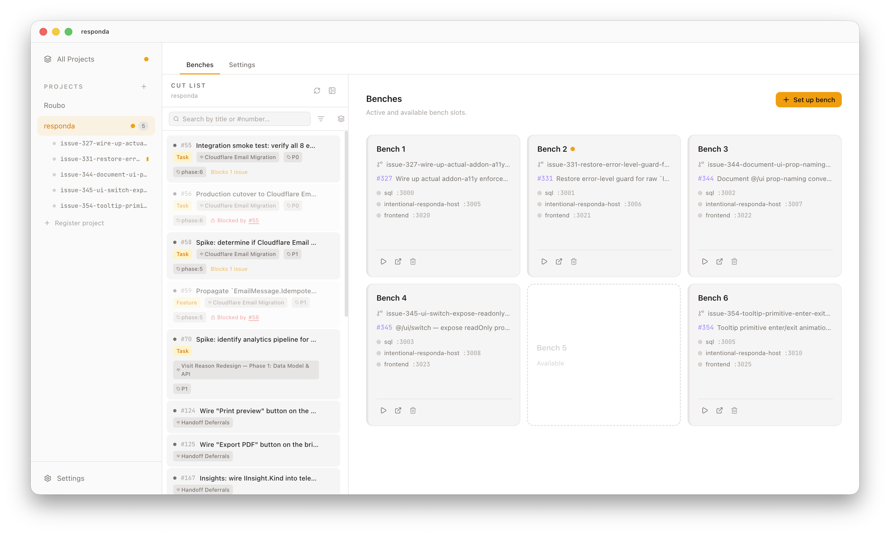

# Roubo

**A workbench for parallel development.**

Run many isolated dev environments off the same repository, each with its own git worktree, database, ports, and processes, so several streams of work can run side by side without colliding.

  

## Why Roubo

Most local-dev tooling assumes one branch at a time. That falls apart the moment you're running an AI coding agent on a feature, want to test a hotfix on `main`, and need a third environment to reproduce a bug, all at the same project.

Roubo solves that. Each **bench** is a git worktree pinned to its own branch, its own port range, and its own container set. You can run several in parallel from one window, hand any of them to an agent, and never untangle a port collision again.

- **Isolated by construction.** Worktrees, ports, and database containers are allocated per bench. Components in bench 1 cannot reach bench 2 by accident.
- **Configured per project.** A small `roubo.yaml` checked into your repo describes the components, ports, and tools for that project. Anyone who clones the repo gets the same setup.
- **Designed for AI coding tools.** Every action in the UI is also a REST endpoint. An AI coding agent can register a project, set up a bench, run inspection, and tear down, all without a human in the loop. See [Supported AI coding tools](#supported-ai-coding-tools).

## Install

Roubo currently ships for **macOS on Apple Silicon**. Intel macOS, Windows, and Linux builds are on the roadmap.

1. Download the latest `.dmg` from the [latest release](https://github.com/davidpoxon/roubo/releases/latest).
2. Open the DMG and drag **Roubo** to `Applications`.
3. Launch Roubo. The web UI opens at `http://localhost:3333` and runs entirely on your machine.

Builds are signed and notarized, so Gatekeeper opens them cleanly.

## Quick start

  <a href="https://github.com/davidpoxon/roubo/releases/latest"><strong>Download Roubo for macOS &nbsp;&rarr;</strong></a>

After installing:

1. Add a `.roubo/roubo.yaml` to a project repo that describes its components and ports. The minimal shape is half a screen of YAML. See [Getting Started](./docs/getting-started.md).
2. In Roubo, open **Settings → Register project** and point it at the repo.
3. Click **Set up bench**, then **Start**. Roubo allocates the next bench number, creates a worktree, brings up the database, runs migrations, starts the processes, and shows you the resolved URLs.

Spin up a second bench from a different branch to run two streams of work in parallel. Each gets its own port range and its own database. They do not interact.

## Supported AI coding tools

Every bench operation Roubo exposes through its UI is also a JSON REST endpoint on `localhost`. The full integration surface (endpoints, request/response shapes, error codes, a worked end-to-end curl example) is in the [API Reference](./docs/api.md). Anything that can speak HTTP from the same machine can drive a bench.

One tool has end-to-end integration today:

- **[Claude Code](https://www.anthropic.com/claude-code)**: Anthropic's command-line coding agent. First-class. Jigs inject Claude Code agent instructions directly into the bench workspace, and Roubo's `permissions` API is wired to Claude Code's tool permission model.

Other tools (Cursor, Windsurf, Aider, OpenAI Codex CLI, and friends) can already drive Roubo via the [API](./docs/api.md). They do not yet have the first-class jig and permission integrations described above. If you've built a deeper integration worth upstreaming, [open an issue](https://github.com/davidpoxon/roubo/issues).

## Documentation

| Topic                                              | What's in it                                                                  |
| -------------------------------------------------- | ----------------------------------------------------------------------------- |
| [Getting Started](./docs/getting-started.md)       | Install, register a project, set up your first bench.                         |
| [Configuration Reference](./docs/configuration.md) | Every field in `roubo.yaml`, with examples.                                   |
| [API Reference](./docs/api.md)                     | Endpoint reference for driving Roubo from external tools, with curl examples. |
| [Architecture](./docs/architecture.md)             | How benches, ports, components, and the API fit together.                     |
| [Development](./docs/development.md)               | Running Roubo from source, code quality, building the desktop app.            |
| [Brand Guide](./docs/brand.md)                     | Vocabulary, design philosophy, and tone.                                      |
| [Contributing](./CONTRIBUTING.md)                  | Issue reporting, PR process, DCO sign-off.                                    |
| [Releasing](./docs/releasing.md)                   | How releases are cut, signed, and published.                                  |
| [Integrations](./docs/integrations.md)             | Configuring GitHub OAuth and other external services.                         |

## Project status

Roubo is **early**. The current release is `v0.1.0`, the surface area is small but real, and the data format (`roubo.yaml`, `~/.roubo/state.json`) may still change before a 1.0. Bug reports and design feedback are welcome; please open an [issue](https://github.com/davidpoxon/roubo/issues) before sending a large PR so we can align on direction.

## The name

Roubo is named after [André-Jacob Roubo](https://en.wikipedia.org/wiki/Andr%C3%A9_Jacob_Roubo) (1739–1791), the French master carpenter whose workbench design (precise, purposeful, nothing superfluous) is the gold standard of fine woodworking. The software aims at the same standard for the workbench you build software on.

## Licence and trademark

Roubo is released under the [Apache License 2.0](./LICENSE). The name "Roubo" and the Roubo logomark are trademarks governed by [TRADEMARK.md](./TRADEMARK.md), not by the Apache 2.0 licence.
